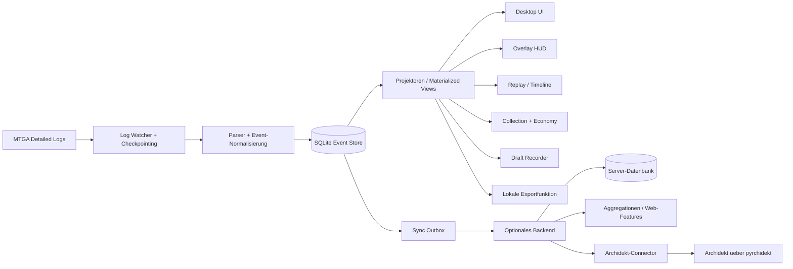

# Zielarchitektur: Unified MTG Companion

_Stand: 2026-05-06_

## Executive Summary

Die Zielplattform ist **kein reiner Upload-Client** und ebenso **kein reiner Local-Only-Tracker**. Das passende Produktmodell ist ein **offline-first Desktop-Companion mit optionalem Backend**:

- Der **Companion** ist lokal voll nutzbar und bleibt auch ohne Account oder Server sinnvoll.
- Das **Backend** erweitert den lokalen Client um Sync, Aggregationen, geräteuebergreifende Nutzung und integrationsgetriebene Mehrwerte.
- Die **MTG-Arena-Anbindung** erfolgt strikt ueber read-only Log Parsing.
- **Archidekt** wird als echte Produktintegration eingeplant, aber so, dass sein Ausfall den Companion nicht unbrauchbar macht.
- Neue Projektergebnisse in diesem Repo stehen unter **Apache-2.0**.

Damit verbinden wir die Breite klassischer Arena-Tracker mit einer moderneren Plattformgrenze: lokal zuerst, Server optional, externe Integrationen modular.

---

## Produktpositionierung

### Produktversprechen

Die App soll die heute fragmentierten Tracker-Funktionen in einem Produkt vereinen:

- Ingame-HUD / Overlay
- lokale Match-History und Statistiken
- Collection-, Inventory- und Economy-Tracking
- Draft-Recorder und spaetere Limited-Analytics
- Replay-/Timeline-Grundlage ueber einen lokalen Event-Store
- Export- und Backup-Funktionen
- optionale Cloud-Sync- und Sharing-Funktionen

### Bewusste Abgrenzung

Die Plattform ist **nicht** als servicezentrierter Thin Client geplant. Der Server soll Zusatznutzen liefern, aber nicht die lokale Kernfunktionalitaet besitzen. Das verhindert dieselbe strukturelle Schwaeche wie bei historischen Tracker-Apps, deren Desktop-Client ohne Backend kaum noch Wert hatte.

---

## Nicht verhandelbare Produktentscheidungen

1. **Backend vorhanden, aber nicht verpflichtend**
   - Ein Nutzer kann den Desktop-Companion ohne Account installieren und verwenden.
   - Cloud-Sync, Multi-Device-Historie, Share-Links, Team- oder Coach-Funktionen bleiben optionale Serverdienste.

2. **Offline-first Companion**
   - Log Parsing, lokale Speicherung, Overlay, History, Replay-Grundlage und Exporte funktionieren ohne Backend.
   - Wenn das Backend nicht erreichbar ist, bleibt der Client funktionsfaehig; nur serverabhaengige Features werden sauber deaktiviert.

3. **Read-only Log Parsing als einzige Spielintegration**
   - Keine Memory Reads
   - Keine DLL-Injection
   - Keine Netzwerk-Interception
   - Keine Spielmanipulation

4. **Archidekt als Produktintegration**
   - Archidekt wird nicht als spaeteres Nice-to-have behandelt.
   - Import, Deck-Abgleich und lokale Deck-Snapshots werden als Teil des Plattformmodells vorgesehen.

5. **Apache-2.0 fuer neue Projektarbeit**
   - Clean-room-Neuimplementierung statt Copy/Paste aus GPL-Codebasen
   - Besonders wichtig: kein direkter Code-Reuse aus `rconroy293/mtga-log-client`, wenn die Gesamtanwendung Apache-2.0 bleiben soll

---

## Architekturprinzipien

### 1. Lokaler Kern vor Cloud-Diensten

Der lokale Client besitzt die fuer den Nutzer sichtbare Basiskompetenz:

- Log-Watching
- Parsing und Normalisierung
- SQLite-basierter Event-Store
- Overlay/HUD
- lokale Such- und Filteransichten
- lokale Exporte und Backups
- lokale Deck- und Matchprojektionen

### 2. Klare Trennung zwischen Kern, Projektionen und Integrationen

Die Architektur soll drei Schichten sauber entkoppeln:

- **Ingestion Layer:** Dateibeobachtung, Checkpointing, Parser
- **Domain Layer:** normalisierte Events, Decks, Matches, Drafts, Collection-Snapshots
- **Presentation/Integration Layer:** Overlay, Desktop-UI, Sync, externe Quellen wie Archidekt

So bleiben Parser-Hotfixes moeglich, ohne UI oder Backend neu zu modellieren.

### 3. Server als Mehrwertschicht, nicht als Kontrollpunkt

Das Backend hat drei Aufgaben:

- **Sync und Konto-Features**
- **aggregierte oder teurere Analysen**
- **externe Integrationen und Sharing**

Es darf keine Funktion uebernehmen, die den Client im Offline-Modus unbrauchbar machen wuerde.

### 4. Integrationen ueber Adapter, nicht im Kern

Archidekt, Kartenmetadaten und spaetere Drittquellen muessen hinter klaren Adapter-Schnittstellen liegen. Der lokale Kern spricht ein internes Normalformat; jeder externe Dienst mappt in dieses Format hinein.

---

## Zielsystem

---

## Plattformaufteilung

| Ebene | Verantwortung | Muss offline funktionieren? |
|---|---|---|
| Desktop Companion | Log-Watching, Parser, lokaler Store, Overlay, History, Exporte, lokale Deck- und Matchansichten | Ja |
| Optionales Backend | Auth, Sync, Konfliktaufloesung, geraeteuebergreifende Daten, Sharing, Aggregationen | Nein |
| Integrationsdienste | Archidekt-Import, spaetere Web- oder Datenquellen | Nein |
| Card-Data Pipeline | Scryfall-/MTGJSON-Snapshots, lokale Caches, Server-Seed-Daten | Teilweise |

### Desktop-Companion

Empfohlener Stack:

- **Rust** fuer Parser, Dateibeobachtung, Domainkern und lokale Persistenz
- **Tauri** als Desktop-Shell
- **TypeScript/React** fuer UI und Overlay-nahe Darstellung
- **SQLite** als lokaler Store

Begruendung:

- Rust bietet robuste Distribution und gute Performance fuer Dauerbeobachtung und Log Parsing.
- Tauri reduziert die Desktop-Runtime-Kosten gegenueber Electron, ohne den Web-UI-Ansatz aufzugeben.
- Die Overlay-Schicht sollte aber hinter einer separaten Boundary liegen, damit bei platform-spezifischer Reibung ein Shell-Wechsel oder ein natives Overlay-Modul moeglich bleibt.

### Optionales Backend

Empfohlene Verantwortung:

- Benutzerkonten und Geraetezuordnung
- verschluesselte Sync-Objekte
- Zusammenfuehrung mehrerer lokaler Stores
- serverseitige Aggregationen und optionale Web-Ansichten
- Integrations-Orchestrierung fuer Archidekt
- Feature Flags und spaetere Beta-Steuerung

Das Backend darf **nicht** Voraussetzung fuer folgende Faehigkeiten sein:

- Spieltracking
- Overlay
- lokale History
- Collection- und Economy-Snapshots
- lokale Replay-/Timeline-Daten
- lokale Exporte

---

## Datenmodell

Der Kern folgt einem append-only Event-Modell mit abgeleiteten Projektionen:

| Entitaet | Zweck |
|---|---|
| `log_session` | bindet eingelesene Logs an Plattform, Pfad und Arena-Version |
| `raw_chunk` | speichert rohe Log-Segmente fuer Parser-Hotfixes |
| `event` | normalisierte atomare Ereignisse aus Arena-Logs |
| `deck` / `deck_version` | lokale und importierte Deck-Snapshots |
| `match` / `game` | Match- und Game-Historie |
| `collection_snapshot` | Kartenbesitz im Zeitverlauf |
| `inventory_snapshot` | Gold, Gems, Wildcards, Vault und andere Oekonomie-Zustaende |
| `draft_run` / `draft_pick` | Draft-Rekonstruktion und spaetere Ratings |
| `opponent_observation` | lokales Opponent Notebook |
| `sync_state` | Dirty-Tracking fuer optionale Server-Sync |
| `integration_snapshot` | importierte Fremddaten, z. B. Archidekt-Decks |

Wichtig ist, dass **lokale Daten autoritativ fuer den Companion bleiben**. Der Server repliziert oder erweitert, ersetzt aber nicht das lokale System of Record fuer den Einzelclient.

---

## Archidekt-Integration

### Produktziel

Archidekt soll Deckverwaltung und Companion enger verzahnen:

- Decks aus Archidekt importieren
- Archidekt-Decks einer lokalen Deck-Identitaet zuordnen
- Snapshots lokal cachen, damit sie spaeter weiter verfuegbar bleiben
- spaeter optional Sync- oder Refresh-Flows anbieten

### Technische Empfehlung

Der Nutzer hat `linkian209/pyrchidekt` explizit genannt. Diese Bibliothek ist eine **Python-Library zum Auslesen von Archidekt-Decks** und zeigt beispielhaft `getDeckById(...)` fuer Deckabfragen. Darauf sollte die erste Integrationsschicht aufbauen, statt direkt einen ad-hoc HTTP-Client neu zu erfinden.

### Warum der Connector serverseitig starten sollte

`pyrchidekt` ist Python-basiert, waehrend der Companion-Kern in dieser Zielarchitektur aus Rust + Tauri + TypeScript besteht. Deshalb ist die sauberste Startloesung:

- **Python-basierter Archidekt-Connector** als eigener Dienst oder Worker
- Nutzung von `pyrchidekt` fuer Pull-basierte Deckimporte
- Normalisierung in ein internes Deckschema
- Rueckgabe an Backend und/oder Desktop als standardisierte `deck_snapshot`-Objekte

So vermeiden wir, dass der Desktop-Client fuer einen einzelnen Integrationsfall eine eingebettete Python-Runtime benoetigt.

### Offline-Verhalten

Die Archidekt-Integration ist **wertvoll, aber nicht load-bearing**:

- Ohne Internet oder ohne Backend bleibt der Companion funktionsfaehig.
- Bereits importierte Archidekt-Decks bleiben lokal als Snapshot erhalten.
- Live-Refresh von Archidekt ist dann einfach nicht verfuegbar.

### Empfohlene Integrationsstufen

1. **Phase 1: Read-only Import**
   - Deck per Archidekt-ID laden
   - in lokales Deckschema normalisieren
   - lokal speichern und Match-History zuordnen

2. **Phase 2: Account-gebundene Refreshes**
   - Backend merkt sich importierte Deckquellen
   - periodischer oder user-ausgeloester Refresh

3. **Phase 3: Bidirektionale Flows nur nach spaeterer Validierung**
   - Export oder Write-Back erst dann, wenn API-Stabilitaet, Rechte und Nutzerwert klar sind

### Offene Integrationsfragen

- Welche Auth- oder Rate-Limit-Grenzen gelten praktisch fuer Archidekt?
- Soll die erste Version nur oeffentliche Decks importieren?
- Ist Deck-Sync bewusst read-only oder spaeter bidirektional?

Bis diese Fragen belastbar geklaert sind, sollte die Produktplanung von **read-only Import plus lokaler Snapshot-Haltung** ausgehen.

---

## Rechts- und Compliance-Rahmen

### Arena-Integration

Die konservative und tragfaehige Integrationslinie bleibt:

- MTG Arena nur ueber **Detailed Logs**
- ausschliesslich **read-only Dateizugriff**
- keine invasive Laufzeitbeobachtung

Das reduziert ToS-, Anti-Cheat- und Reputationsrisiken.

### Lizenzmodell

Neue Artefakte in diesem Repo sollen unter **Apache License 2.0** stehen. Das passt gut zu:

- offenem Kern
- flexiblen Integrationsmodulen
- moeglicher spaeterer Server- oder Plugin-Topologie

Konsequenzen:

- Kein direkter Code-Reuse aus GPL-3.0-Komponenten, wenn die Gesamtbasis Apache-2.0 bleiben soll.
- MIT-lizenzierte Inspirationsquellen koennen als Referenz dienen, sollten aber wegen Wartbarkeit und Konsistenz ebenfalls bevorzugt clean-room nachgebaut werden.

---

## MVP-Schnitt

### In MVP

- Setup-Assistent fuer Detailed Logs
- Pfad-Autodetect fuer Windows und macOS
- lokaler Event-Store
- Match-History und Deckansichten
- Overlay/HUD mit Kernsignalen
- Collection- und Economy-Snapshots
- Draft Recorder
- No-Account-Modus
- lokale Exporte und Backups
- Backend-Grundlage fuer optionale Sync
- erste Archidekt-Read-only-Importstrecke

### Nach MVP

- Replay-/Timeline-Viewer mit Confidence-Hinweisen
- Opponent Notebook
- serverseitige Aggregationsansichten
- Team-/Coach-Funktionen
- bidirektionale Archidekt-Flows
- Linux/Proton als experimenteller Pfad

---

## Klare Architekturentscheidung

Die richtige Zielarchitektur fuer dieses Projekt lautet:

> **Ein lokaler Desktop-Companion mit eigenem Event-Store und optionalem Backend fuer Sync, Aggregationen und Integrationen; Archidekt wird ueber einen separaten Connector auf Basis von `pyrchidekt` eingebunden; der gesamte neue Stack wird als Apache-2.0-Clean-room aufgebaut.**

Diese Entscheidung balanciert Produktnutzen, Wartbarkeit, Rechtsrisiko und Zukunftsfaehigkeit besser als entweder ein reiner Uploader oder ein rein lokaler Tracker ohne Erweiterungsschicht.
