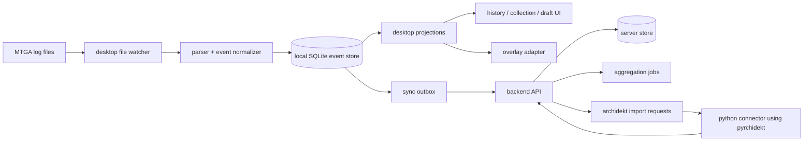

# feat: Build the MancuTG-Companion platform foundation

## Summary

Dieses Dokument beschreibt, wie das Repo von einer leeren Basis zu einer tragfaehigen Produktplattform fuer den MancuTG-Companion aufgebaut werden soll. MancuTG-ArenaC bleibt lokal und offline-first nutzbar; das optionale MancuTG-backend liefert Sync, Aggregationen und Integrationen wie Archidekt, ohne den Kernnutzen der Desktop-App zu uebernehmen.

---

## Problem Frame

Bestehende Arena-Tracker zerfallen typischerweise in zwei unbefriedigende Extreme: entweder lokale Tools ohne moderne Erweiterungsschicht oder serverzentrierte Upload-Clients, die ohne Konto und Backend deutlich an Wert verlieren. Dieses Projekt soll stattdessen eine Architektur etablieren, in der lokales Tracking, Overlay und History jederzeit funktionieren, waehrend Backend- und Integrationsdienste modular hinzukommen.

---

## Requirements

- R1. MancuTG-ArenaC muss ohne Account und ohne laufendes MancuTG-backend lokal nutzbar bleiben.
- R2. Die Arena-Integration muss auf read-only Log Parsing basieren.
- R3. Das lokale Datenmodell muss Match-History, Collection/Economy, Draft-Daten und Replay-Grundlagen tragen koennen.
- R4. Das MancuTG-backend muss als optionale Mehrwertschicht fuer Sync, Sharing und Aggregationen modelliert werden.
- R5. Archidekt muss als vorgesehene Produktintegration eingeplant werden, ohne den Companion an einen Online-Zwang zu koppeln.
- R6. Neue Projektarbeit muss mit Apache-2.0 kompatibel bleiben und GPL-kontaminierenden Code-Reuse vermeiden.
- R7. Die Architektur muss Parser-Brueche, neue Arena-Patches und spaetere Feature-Erweiterungen isolieren koennen.
- R8. iOS/iPadOS-Tracking wird auf dem Desktop nur ueber Offline-Logimport unterstuetzt, inklusive Deduplizierung, Plattform-Tagging als `ios` und klarer Export-Guidance fuer Apple Devices/Finder.

---

## Scope Boundaries

- Diese Planung implementiert noch keinen produktionsreifen Tracker; sie beschreibt die erste belastbare Systemform.
- Linux/Proton-Support ist nicht Teil des Anfangsaufbaus.
- Bidirektionaler Archidekt-Sync ist nicht Teil der ersten Integrationsstufe.
- Ein serverseitiges Pflichtkonto fuer Basisfunktionen ist ausgeschlossen.
- Kein Live-Tracking, Overlay, Packet Capture, Jailbreak-/Sandbox-Zugriff oder Memory Inspection auf iOS/iPadOS.

### Deferred to Follow-Up Work

- Replay-/Timeline-Polish und visuelle Replay-Navigation: spaetere Produktiteration nach stabilem Event-Modell.
- Oeffentliche Web-Profile, Share-Links und Team-/Coach-Funktionen: separate Backend-Produktphase.
- Linux/Proton-Packaging und Support-Playbook: separate Plattformphase.

---

## Context & Research

### Relevant Code and Patterns

- `README.md`: fasst die jetzt festgelegte Produktthese und Architekturgrenzen zusammen.
- `docs/architecture/unified-mtg-companion-architecture.md`: dient als architektonische Source of Truth fuer Backend-vs-Companion-Abgrenzung, Archidekt-Rolle und Lizenzstrategie.

### Institutional Learnings

- Es existieren noch keine `docs/solutions/`-Artefakte im Repo; diese Planung setzt daher die initiale Architekturspur.

### External References

- `linkian209/pyrchidekt`: Python-Library fuer Archidekt-Deckabfragen; dient als konkrete Referenz fuer den ersten Integrationsadapter.
- Offizielle MTG Arena "Detailed Logs"-Dokumentation: begruendet den log-only Integrationsweg.
- Apache License 2.0: Lizenzrahmen fuer neue Repo-Inhalte.

---

## Key Technical Decisions

- **MancuTG-ArenaC mit optionalem MancuTG-backend:** Die Desktop-App ist das primaere Produkt, das Backend eine Zusatzschicht fuer Sync, Aggregation und Integrationen.
- **Rust + Tauri + React fuer MancuTG-ArenaC:** Rust kapselt Parser, File-Watching und SQLite; Tauri/React bildet die Desktop-Oberflaeche mit spaeter austauschbarer Overlay-Grenze.
- **Append-only lokaler Event-Store:** Rohlog-Daten und normalisierte Events werden lokal in MancuTG-ArenaC gehalten, damit Parser-Hotfixes, Replays und Exporte auf derselben Basis aufbauen.
- **MancuTG-backend als API + Worker-Topologie:** Sync und Integrationen werden ueber klar getrennte Serverdienste modelliert, damit weder UI noch Parser von Integrationslaufzeiten abhaengen.
- **Archidekt ueber separaten Python-Connector:** `pyrchidekt` wird in einem Connector/Worker isoliert, statt Python in den Desktop-Client einzubetten.
- **Clean-room unter Apache-2.0:** Inspirationsquellen duerfen Architektur und UX beeinflussen, aber die Implementierung bleibt neu und lizenzsauber.
- **iOS/iPadOS nur als Offline-Importpfad:** Der Desktop importiert exportierte `.log`-Dateien per Drag & Drop oder Ordnerimport, taggt Sessions als `ios` und behandelt eine spaetere iOS-App nur als Viewer-/Sync-/Import-Helper.

---

## Open Questions

### Resolved During Planning

- **Soll ein MancuTG-backend existieren, obwohl Offline-Nutzung Pflicht ist?** Ja. Das Backend ist explizit vorgesehen, aber nie Voraussetzung fuer lokale Kernfunktionen.
- **Wo wird Archidekt zuerst integriert?** Serverseitig in einem eigenen Connector auf Basis von `pyrchidekt`, mit lokalem Cache auf Companion-Seite.
- **Welche Lizenz gilt fuer neue Arbeit?** Apache-2.0.

### Deferred to Implementation

- **Welche konkrete Backend-Technologie wird verwendet?** Die Architektur braucht API-, Queue- und Storage-Grenzen, aber das exakte Framework kann spaeter nach Team-Praeferenz entschieden werden.
- **Wie genau wird das Overlay auf macOS und Windows technisch umgesetzt?** Die Boundary ist Teil der Planung; die finale plattformspezifische Technik muss bei der Umsetzung validiert werden.
- **Wie weit reicht Archidekt in Version 1?** Der Plan setzt read-only Import voraus; weitergehende Write-Back-Flows haengen von API- und Produktvalidierung ab.
- **Wie exportieren Nutzer iOS-Logs konkret?** Die Produktspur setzt Apple Devices auf Windows und Finder auf macOS als Primaerweg voraus, mit Fallback-Hinweis auf Drittanbieter-Dateiuebertragung, falls MTGA dort nicht sichtbar ist.

---

## Output Structure

    apps/
      desktop/
        src/
        src-tauri/
        tests/
    crates/
      core-domain/
      core-parser/
      core-store/
      core-sync/
    services/
      api/
      archidekt-connector/
      worker/
    packages/
      shared-schema/
    docs/
      architecture/
      plans/

---

## High-Level Technical Design

> *This illustrates the intended approach and is directional guidance for review, not implementation specification. The implementing agent should treat it as context, not code to reproduce.*

---

## Implementation Units

- U1. **Repository foundation and licensing**

**Goal:** Die Grundstruktur des Repos so anlegen, dass Companion, Backend und Integrationen als zusammenhaengende, aber entkoppelte Module entwickelt werden koennen.

**Requirements:** R1, R4, R6, R7

**Dependencies:** None

**Files:**
- Create: `apps/desktop/`
- Create: `crates/core-domain/`
- Create: `crates/core-parser/`
- Create: `crates/core-store/`
- Create: `crates/core-sync/`
- Create: `services/api/`
- Create: `services/worker/`
- Create: `services/archidekt-connector/`
- Create: `packages/shared-schema/`
- Modify: `README.md`
- Modify: `LICENSE`
- Test: `apps/desktop/tests/smoke/app-shell.spec.ts`

**Approach:**
- Repo frueh entlang der finalen Systemgrenzen schneiden, statt zunaechst einen monolithischen Proto-Ordner anzulegen.
- Companion, Shared Schema und Serverdienste als getrennte Baugruppen strukturieren.
- Lizenz- und Architekturentscheidungen bereits in der Basiskonfiguration sichtbar machen.

**Patterns to follow:**
- `README.md`
- `docs/architecture/unified-mtg-companion-architecture.md`

**Test scenarios:**
- Happy path: Ein frischer Checkout zeigt eine eindeutige Repo-Struktur fuer Desktop, Kernmodule und Serverdienste.
- Edge case: Neue Mitwirkende koennen aus dem Wurzel-README erkennen, dass der Server optional ist und nicht die Basisfunktion bereitstellt.
- Integration: Die gemeinsame Schema-Lage in `packages/shared-schema/` ist als neutraler Vertrag zwischen Desktop und Server dokumentiert.

**Verification:**
- Die Verzeichnisstruktur spiegelt die Architekturgrenzen direkt im Repo wider.
- Lizenz und Produktthese sind fuer Mitwirkende ohne Zusatzwissen erkennbar.

---

- U2. **Local ingestion and event-store core**

**Goal:** Den Companion-Kern fuer Log-Watching, Parser-Pipeline, Checkpointing und lokale Persistenz definieren.

**Requirements:** R1, R2, R3, R7

**Dependencies:** U1

**Files:**
- Create: `crates/core-parser/src/`
- Create: `crates/core-domain/src/`
- Create: `crates/core-store/src/`
- Create: `crates/core-store/migrations/`
- Create: `apps/desktop/src-tauri/src/ingestion/`
- Create: `apps/desktop/src-tauri/src/state/`
- Test: `crates/core-parser/tests/golden_logs.rs`
- Test: `crates/core-store/tests/event_store_roundtrip.rs`
- Test: `apps/desktop/src-tauri/tests/offline_bootstrap.rs`

**Approach:**
- Log-Dateien ueber Dateibeobachtung und Checkpoints inkrementell verarbeiten.
- Rohchunks getrennt von normalisierten Events ablegen, damit Parser-Hotfixes Reprocessing erlauben.
- Den Store so schneiden, dass Match-, Collection-, Inventory- und Draft-Projektionen darauf aufbauen koennen.

**Execution note:** Add characterization coverage before expanding the parser surface beyond a minimal starter corpus.

**Technical design:** *(optional -- pseudo-code or diagram when the unit's approach is non-obvious. Directional guidance, not implementation specification.)*
- Ingestion schreibt `raw_chunk` und `event` getrennt.
- Projektoren lesen aus `event`, nie direkt aus dem Dateiwatcher.
- Unknown Events werden explizit persistiert, statt still verworfen zu werden.

**Patterns to follow:**
- `docs/architecture/unified-mtg-companion-architecture.md`

**Test scenarios:**
- Happy path: Ein neues Log-Segment wird genau einmal eingelesen und als rohe Eingabe plus normalisierte Events persistiert.
- Happy path: Ein Neustart des Clients setzt nach dem letzten Checkpoint fort und dupliziert keine Events.
- Edge case: Unbekannte Eventtypen landen in einer Unknown-Event-Pipeline, ohne den restlichen Import abzubrechen.
- Error path: Wenn eine Log-Datei temporaer nicht lesbar ist, bleibt der Client im lokalen Modus stabil und kann spaeter weiterarbeiten.
- Integration: Aus einer reprasentativen Golden-Log-Datei entstehen reproduzierbare Match-, Collection- und Draft-bezogene Eventfolgen.

**Verification:**
- Der lokale Kern kann ein MTGA-Log inkrementell lesen, normalisieren und dauerhaft speichern.
- Reprocessing und Parser-Hotfixes sind ohne Datenverlust konzeptionell moeglich.

---

- U3. **MancuTG-ArenaC surfaces for offline-first workflows**

**Goal:** Die ersten MancuTG-ArenaC-Oberflaechen auf den lokalen Store aufsetzen: Setup, History, Collection/Economy, Draft und Export.

**Requirements:** R1, R2, R3, R7, R8

**Dependencies:** U2

**Files:**
- Create: `apps/desktop/src/routes/setup/`
- Create: `apps/desktop/src/routes/history/`
- Create: `apps/desktop/src/routes/collection/`
- Create: `apps/desktop/src/routes/draft/`
- Create: `apps/desktop/src/routes/settings/`
- Create: `apps/desktop/src/lib/query/`
- Create: `apps/desktop/src/lib/export/`
- Test: `apps/desktop/tests/setup-detailed-logs.spec.ts`
- Test: `apps/desktop/tests/history-view.spec.ts`
- Test: `apps/desktop/tests/collection-snapshots.spec.ts`
- Test: `apps/desktop/tests/export-json-csv.spec.ts`

**Approach:**
- Den Nutzer zuerst sicher durch Detailed-Logs-Aktivierung und Pfad-Autodetect fuehren.
- UI ausschliesslich ueber lokale Projektionen betreiben, nicht ueber direkte Parserzustande.
- Export- und Backup-Pfade frueh mitdenken, damit der lokale Modus auch ohne Cloud glaubhaft vollwertig ist.
- Fuer iOS/iPadOS einen separaten Offline-Importpfad mit Drag & Drop, Ordnerimport, Plattform-Tagging und Export-Hinweisen fuer Apple Devices/Finder vorsehen.

**Patterns to follow:**
- `docs/architecture/unified-mtg-companion-architecture.md`
- `README.md`

**Test scenarios:**
- Happy path: Ein Nutzer kann einen Log-Pfad bestaetigen und danach lokale Match-History ohne Konto sehen.
- Happy path: Collection- und Economy-Snapshots zeigen den letzten bekannten lokalen Zustand an.
- Happy path: Exportierte iOS-Logs koennen per Drag & Drop oder Ordnerimport importiert und als `ios` markiert werden.
- Edge case: Ohne vorhandene Match-Daten zeigt die UI leere, aber valide Zustande statt Fehler.
- Edge case: Wiederholte iOS-Importe derselben `.log`-Dateien erzeugen keine doppelten Sessions oder Events.
- Error path: Wenn Detailed Logs noch nicht aktiviert sind, zeigt der Setup-Fluss konkrete Hilfestellung statt stiller Fehlfunktion.
- Integration: Ein Export aus der lokalen History erzeugt ein konsistentes JSON- oder CSV-Artefakt, das ohne Serverbezug verwendbar ist.

**Verification:**
- Ein Nutzer kann die Kernworkflows lokal ausfuehren, ohne sich einzuloggen oder einen Server zu konfigurieren.
- Die UI ist an stabile lokale Abfragen gekoppelt und nicht an fluechtige Parserzustaende.

---

- U4. **Optional MancuTG-backend for sync and aggregation**

**Goal:** Eine MancuTG-backend-Architektur etablieren, die lokale MancuTG-ArenaC-Daten optional erweitert, aber nie ersetzt.

**Requirements:** R1, R4, R7

**Dependencies:** U1, U2

**Files:**
- Create: `services/api/src/`
- Create: `services/api/src/routes/`
- Create: `services/api/src/domain/`
- Create: `services/api/src/auth/`
- Create: `services/worker/src/`
- Create: `crates/core-sync/src/`
- Create: `packages/shared-schema/src/`
- Test: `services/api/tests/sync-contract.spec.ts`
- Test: `services/api/tests/auth-optional-mode.spec.ts`
- Test: `crates/core-sync/tests/outbox_serialization.rs`

**Approach:**
- Sync ueber Outbox/Inboxes mit explizitem Dirty-Tracking modellieren.
- Konto- und Sync-Funktionen als additive Ebene behandeln; der Desktop bleibt auch ohne Token oder Session voll nutzbar.
- Gemeinsame Schemas fuer Desktop-zu-Server-Nachrichten frueh zentralisieren.

**Execution note:** Start with a failing integration test for the sync contract before filling in transport details.

**Patterns to follow:**
- `docs/architecture/unified-mtg-companion-architecture.md`

**Test scenarios:**
- Happy path: Ein lokaler Companion kann eine geaenderte Entitaet als Sync-Objekt serialisieren, ohne seine lokale Autoritaet zu verlieren.
- Edge case: Wenn kein Konto vorhanden ist, bleibt die Outbox lokal bestehen und blockiert keine Companion-Funktion.
- Error path: Ein fehlgeschlagener Sync-Versuch markiert Daten nicht als verloren oder erfolgreich synchronisiert.
- Integration: Desktop und Backend teilen dieselbe Payload-Definition fuer Deck-, Match- und Snapshot-Objekte.
- Integration: Der Server akzeptiert Sync-Daten nur fuer optionale Konto-Features und veraendert keine lokal-only Kernfunktionalitaet.

**Verification:**
- Die Servergrenze ist technisch real, aber funktional optional.
- Sync kann spaeter erweitert werden, ohne Desktop-Kernworkflows zu zerbrechen.

---

- U5. **Archidekt import and deck normalization**

**Goal:** Archidekt als vorgesehene Integrationsspur modellieren, inklusive lokalem Deck-Caching und read-only Importfluss.

**Requirements:** R1, R4, R5, R6

**Dependencies:** U1, U3, U4

**Files:**
- Create: `services/archidekt-connector/src/`
- Create: `services/archidekt-connector/tests/`
- Create: `services/api/src/routes/integrations/archidekt/`
- Create: `apps/desktop/src/routes/decks/`
- Create: `apps/desktop/src/lib/decks/`
- Create: `packages/shared-schema/src/archidekt/`
- Test: `services/archidekt-connector/tests/pyrchidekt-readonly-import.spec.py`
- Test: `services/api/tests/archidekt-import-contract.spec.ts`
- Test: `apps/desktop/tests/archidekt-snapshot-cache.spec.ts`

**Approach:**
- `pyrchidekt` im Python-Connector verwenden, um Deckdaten abzurufen und in ein internes Deck-Snapshot-Schema zu normalisieren.
- Den Desktop nur standardisierte Importergebnisse konsumieren lassen, damit er keine Python-Runtime benoetigt.
- Importierte Decks lokal cachen und mit lokaler Match-History verknuepfbar machen.
- Zunaechst read-only bleiben; Write-Back explizit nicht vorziehen.

**Patterns to follow:**
- `docs/architecture/unified-mtg-companion-architecture.md`

**Test scenarios:**
- Happy path: Ein gueltiger Archidekt-Deck-Identifier fuehrt zu einem normalisierten Deck-Snapshot, den der Desktop lokal speichern kann.
- Edge case: Bereits importierte Decks koennen offline weiter angezeigt werden, auch wenn der Connector nicht erreichbar ist.
- Error path: Ein fehlgeschlagener Archidekt-Abruf liefert einen expliziten Integrationsfehler, ohne Deckansichten oder Match-History zu blockieren.
- Error path: Unerwartete Fremddaten aus dem Connector werden vor Speicherung validiert und nicht ungeprueft uebernommen.
- Integration: Desktop, API und Connector teilen dieselbe Deck-Snapshot-Form fuer Importantworten.

**Verification:**
- Archidekt ist technisch eingebunden, aber nicht load-bearing fuer den Companion.
- Die erste Integrationsstufe ist klar read-only und Apache-2.0-kompatibel umsetzbar.

---

- U6. **Privacy, telemetry, and release hardening**

**Goal:** Privacy-first Defaults, transparente Netzwerknutzung und release-faehige Desktop-/Servergrenzen festlegen.

**Requirements:** R1, R2, R4, R6, R7

**Dependencies:** U2, U3, U4, U5

**Files:**
- Create: `apps/desktop/src/routes/privacy/`
- Create: `apps/desktop/src/lib/network/`
- Create: `services/api/src/telemetry/`
- Create: `docs/privacy/data-flow.md`
- Create: `.github/workflows/`
- Test: `apps/desktop/tests/privacy-center.spec.ts`
- Test: `apps/desktop/tests/network-opt-in.spec.ts`
- Test: `services/api/tests/telemetry-opt-in.spec.ts`

**Approach:**
- Netzwerknutzung im Desktop sichtbar machen und Telemetrie strikt opt-in schneiden.
- Release-Signing, Update-Kanaele und Fehlergrenzen frueh im Delivery-Modell beruecksichtigen.
- Datenschutz- und Betriebsdokumentation zusammen mit dem Codepfad anlegen, nicht erst am Ende.

**Patterns to follow:**
- `docs/architecture/unified-mtg-companion-architecture.md`

**Test scenarios:**
- Happy path: Ein Nutzer kann den Companion voll lokal verwenden, ohne Telemetrie oder Sync zu aktivieren.
- Edge case: Bereits aktivierte Sync bleibt ausgeschaltet, wenn ein Privacy-Schalter serverseitige Features pausiert.
- Error path: Ein unbeabsichtigter Netzwerkpfad im lokalen Modus wird durch zentrale Netzwerksteuerung blockiert oder sichtbar gemacht.
- Integration: Privacy-Center, Netzwerk-Schicht und optionale Backend-Features stimmen in ihren Zustandsmodellen ueberein.

**Verification:**
- Datenschutz- und Betriebsgrenzen sind Teil der Architektur, nicht nachgelagerte Doku.
- Offline-first ist auch im tatsaechlichen Netzwerkverhalten glaubhaft.

---

## System-Wide Impact

- **Interaction graph:** Desktop-Ingestion, lokaler Store, UI-Projektionen, Sync-Outbox, API und Archidekt-Connector teilen Vertragsobjekte und muessen dieselben Invarianten fuer Decks, Matches und Snapshots einhalten.
- **Import surfaces:** Desktop-Live-Logs und iOS-Offline-Logs muessen denselben Parser- und Projektionskern nutzen, sich aber in Plattform-Tagging und User-Guidance unterscheiden.
- **Error propagation:** Parser-, Sync- und Integrationsfehler duerfen Kernworkflows nicht abbrechen; sie muessen als isolierte degradierte Zustaende sichtbar werden.
- **State lifecycle risks:** Doppelte Events, inkonsistente Deckversionen, stale Sync-Markierungen und ueberholte Integrationssnapshots sind die zentralen Persistenzrisiken.
- **API surface parity:** Desktop-Interaktionen, spaetere Web-Flaechen und Integrationsdienste muessen auf denselben Shared-Schema-Vertrag zugreifen.
- **Integration coverage:** Parser->Store, Store->UI, Outbox->API und API->Archidekt-Connector benoetigen echte Integrationsabdeckung; reine Unit-Tests reichen dort nicht.
- **Unchanged invariants:** Der Companion bleibt ohne Konto nutzbar; Arena wird nur ueber Logs gelesen; Archidekt bleibt in Version 1 read-only.

---

## Risks & Dependencies

| Risk | Mitigation |
|------|------------|
| Arena-Logformate aendern sich haeufig | Golden-Logs, Unknown-Event-Pipeline und getrennte Parser-Module von Anfang an vorsehen |
| Serverlogik verdriftet zu einer Pflicht-Cloud | Produkt- und Vertragsebene auf "local-first, sync-optional" festschreiben und in Tests absichern |
| Archidekt bringt Betriebs- oder API-Risiken mit | Connector isolieren, read-only starten, lokales Snapshot-Caching vorsehen |
| Lizenzgrenzen werden spaeter unsauber | Apache-2.0 frueh festlegen, Clean-room dokumentieren, keine GPL-Uebernahmen |
| Privacy verliert gegen Komfort-Features | Opt-in-Telemetrie, sichtbare Netzwerkpfade und lokaler Default in Architektur und UI verankern |

---

## Documentation / Operational Notes

- Das Architekturpapier in `docs/architecture/unified-mtg-companion-architecture.md` sollte parallel zur Umsetzung gepflegt werden.
- Mit dem ersten Implementierungsschritt sollten Installations- und Entwicklungsdocs fuer Desktop, API und Archidekt-Connector entstehen.
- Vor einer oeffentlichen Beta braucht das Projekt klare Signierungs-, Update- und Support-Runbooks fuer Windows und macOS.

---

## Sources & References

- Related code: `README.md`
- Related code: `docs/architecture/unified-mtg-companion-architecture.md`
- External docs: `https://github.com/linkian209/pyrchidekt`
