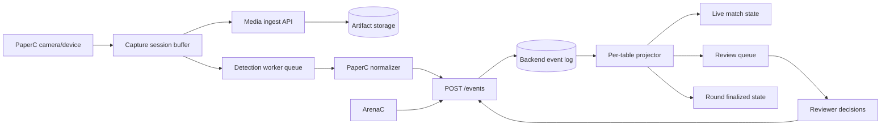

# feat: Plan MancuTG-PaperC tournament video detection

## Summary

Dieses Dokument beschreibt, wie MancuTG-PaperC als Turnier-Video-Erkennungsprodukt in die bestehende MancuTG-Companion-Architektur eingefuehrt werden soll. Der Schwerpunkt liegt auf einer serverfaehigen, reviewbaren und parallelisierbaren Erkennungspipeline, die mehrere gleichzeitige Spiele ueber MancuTG-backend verarbeiten kann, ohne die bereits vorhandenen ArenaC-/Backend-Vertraege zu zerbrechen.

---

## Problem Frame

MancuTG-backend besitzt jetzt bereits eine gemeinsame Event-Huelle fuer MancuTG-ArenaC und MancuTG-PaperC, aber noch keine PaperC-spezifische Domänenmodellierung fuer Videoquellen, Tisch-/Rundenkontext, Review-Schleifen oder parallele Spielverarbeitung. Fuer Turnier-Video-Erkennung reicht eine generische `/events`-Ingestion nicht aus: sobald mehrere Tische gleichzeitig laufen, muessen Medienartefakte, Event-Identitaeten, Worker-Partitionierung, Review-Prozesse und Projektionslogik explizit modelliert werden, damit Ergebnisse weder kollidieren noch inkonsistent publiziert werden.

---

## Requirements

- R1. MancuTG-PaperC muss Turnierpartien per Videoaufnahme erfassen koennen, ohne dass der Erkennungsstack die bestehende MancuTG-ArenaC-Architektur dupliziert.
- R2. MancuTG-backend muss mehrere gleichzeitige Spiele, Tische und Turnierrunden parallel verarbeiten koennen.
- R3. MancuTG-PaperC und MancuTG-ArenaC muessen weiterhin dieselbe gemeinsame Backend-Event-Huelle verwenden; PaperC darf keinen proprietaeren Sonderweg fuer Standard-Eventing einfuehren.
- R4. Die Architektur muss zwischen Medieningest, normalisierten Events, Review/Korrektur und finalen Projektionen sauber trennen.
- R5. Deduplizierung, Idempotenz und Ordering muessen fuer konkurrierende Produzenten und Retries explizit modelliert werden.
- R6. Niedrig sichere oder widerspruechliche Detektionen muessen in einen menschlich reviewbaren Workflow uebergehen, statt direkt als autoritative Matchzustände publiziert zu werden.
- R7. Der Plan muss mit dem aktuellen Repozustand kompatibel sein: shared-schema, `/events`, startbarer MancuTG-backend-Server und der append-only/Projektionsansatz bleiben erhalten.
- R8. Privacy, Medien-Retention und Rollenrechte fuer Capture, Review und Finalisierung muessen Teil des Designs sein.
- R9. Der erste Umsetzungsstand soll mehrere gleichzeitige Spiele robust behandeln, auch wenn noch nicht alle Vision-Modelle oder UI-Flaechen final sind.

---

## Scope Boundaries

- Dieses Dokument plant die Implementierung von MancuTG-PaperC als Turnier-Video-Erkennungssystem, nicht die Umsetzung eines vollstaendigen Production-ML-Stacks in einem Schritt.
- Es fuehrt keinen Versuch ein, Video als Live-Coaching-, Judge- oder Ruling-Automatisierungswerkzeug in sanktionierten Matches zu verwenden.
- Die bereits existierende ArenaC-Logik wird nicht auf Videoerkennung umgebaut; sie bleibt ein eigener Produzent fuer dieselbe Backend-Ereignisschicht.
- Der Plan fuehrt keine bidirektionale Companion-/Wizards-Integration ein.

### Deferred to Follow-Up Work

- Modelltraining, Datenannotation und langfristige Vision-Modellverbesserung als eigenes ML-Track
- Hochwertige Replay-/Broadcast-Oberflaechen fuer Turnierzuschauer
- Eventuelle Multi-Game-Unterstuetzung jenseits MTG im selben PaperC-Client
- Self-hosting-/Enterprise-Deploymentvarianten fuer sehr grosse Turniere

---

## Context & Research

### Relevant Code and Patterns

- `packages/shared-schema/src/events.ts`: bestehende gemeinsame Event-Huelle mit `eventId`, `sourceApp`, `eventType`, `occurredAt` und `payload`
- `services/api/src/domain/eventService.ts`: aktueller Dedupe-Ansatz (`sourceApp + eventId`)
- `services/api/src/routes/events.ts`: bestehende `/events`-Ingestion fuer MancuTG-ArenaC und MancuTG-PaperC
- `services/api/src/server.ts`: startbarer MancuTG-backend-Server mit Health-/Sync-/Archidekt-/Events-Routen
- `docs/architecture/unified-mtg-companion-architecture.md`: Produktgrenzen fuer MancuTG-backend, MancuTG-ArenaC und MancuTG-PaperC
- `docs/plans/2026-05-06-001-feat-unified-mtg-companion-platform-plan.md`: Foundations-Plan inkl. gemeinsamer Event-Schnittstelle
- `docs/plans/2026-05-06-002-feat-foundation-functionalization-plan.md`: aktueller Audit-Stand und funktionalisierte Einstiegspunkte

### Institutional Learnings

- Es gibt weiterhin keine `docs/solutions/`-Artefakte; die Architektur- und Planungsdokumente fungieren derzeit als de-facto Learnings.
- Die aktuelle Repo-Doku ist konsistent darin, dass Event-Ingestion und Sync zwei getrennte Vertraege bleiben muessen.
- Die aktuelle `/events`-Ingestion ist bewusst generisch; PaperC muss deshalb ueber explizite Zusatzidentitaeten und Review-/Projektionsschichten wachsen, nicht ueber eine komplett separate Basisschnittstelle.

### External References

- Session-provided deep research report on unified event modeling, sync protocol, privacy constraints, and Paper camera workflows
- Offizielle Wizards-Dokumentation zu Arena-Logs und iOS-Logexport als Referenz fuer die bereits bestehende ArenaC-Seite

---

## Key Technical Decisions

- **Gleiche Event-Huelle, getrennte Producer-Logik:** MancuTG-PaperC verwendet dieselbe Backend-Event-Huelle wie MancuTG-ArenaC, erhaelt aber eigene PaperC-spezifische Validatoren, Feldkonventionen und Projektionen.
- **Medieningest ist nicht dasselbe wie Eventing:** Rohvideo, Clips, Frames oder Artefakt-Manifeste dürfen nicht direkt ueber `/events` laufen. `/events` bleibt fuer normalisierte Beobachtungen, Korrekturen und Finalisierungen; Medien erhalten einen separaten Upload-/Artefaktpfad.
- **Append-only fuer Rohbeobachtungen, Projektionen fuer Wahrheit:** Automatische Detektionen, Review-Entscheidungen und manuelle Korrekturen werden als Ereignisse gespeichert; der autoritative Turnierzustand entsteht in Projektionen.
- **Parallelitaet ueber Partitionsschluessel statt globaler Queue:** Worker und Projektoren werden mindestens nach `tournamentId + roundId + tableId` (oder einem abgeleiteten `matchStreamKey`) partitioniert. Innerhalb eines Streams gilt ordering, zwischen Streams gilt Parallelitaet.
- **Review ist ein Kernworkflow, kein Ausnahmefall:** Niedrig sichere oder widerspruechliche Vision-Outputs muessen eine eigene Review-Queue speisen, statt in „best effort“-Autozustand zu verschwinden.
- **MancuTG-PaperC benoetigt explizite Capture-Identitaet:** Die aktuelle Dedupe-Regel `sourceApp + eventId` reicht fuer parallele Videoquellen allein nicht. PaperC braucht zusaetzliche stabile Kontextfelder wie `tournamentId`, `roundId`, `tableId`, `matchId`, `captureSessionId` und `cameraId` innerhalb seines Payload-Vertrags.
- **Finalisierung und Reopen als eigene Domänenereignisse:** Ein erkannter oder manueller Matchabschluss darf nicht einfach ein boolescher Zustand sein. Finalisierung, Reopen und Korrektur muessen auditable Ereignisse mit Projektion sein.

---

## Open Questions

### Resolved During Planning

- **Soll MancuTG-PaperC dieselbe Backend-Basisschnittstelle wie MancuTG-ArenaC verwenden?** Ja. Die bestehende `/events`-Huelle bleibt der gemeinsame Basiskanal.
- **Soll Rohvideo ueber dieselbe Schnittstelle wie Events laufen?** Nein. Medien und normalisierte Events werden getrennt transportiert.
- **Soll Mehrspiel-/Mehrtisch-Verarbeitung zentral oder partitioniert erfolgen?** Partitioniert. Per-Stream-Ordering, Cross-Stream-Parallelitaet.

### Deferred to Implementation

- **Welches konkrete Vision-Modell oder welche OCR-/CV-Bibliothek wird zuerst verwendet?** Das beeinflusst Worker-Implementierung und Hardwareprofil, aber nicht die Zielarchitektur.
- **Wie gross sind die erlaubten Artefakte (vollstaendige Videos vs. Clips vs. Frames)?** Das haengt von Betriebskosten, Datenschutz und Turniergroesse ab.
- **Welche Rollen- und Rechtemodelle gelten fuer Reviewer/Judges in der ersten Version?** Die Architektur braucht Rollenpunkte, aber die exakte Auth-Topologie kann spaeter konkretisiert werden.
- **Welche Eventtypen werden im PaperC-MVP voll automatisiert und welche zuerst manuell/review-first?** Das muss aus Modellfaehigkeit und Produktwert priorisiert werden.

---

## Output Structure

    apps/
      paperc/
        src/
        tests/
    packages/
      shared-schema/
        src/
          events.ts
          paperc.ts
          tournaments.ts
    services/
      api/
        src/
          domain/
            eventService.ts
            paperc/
          projectors/
          routes/
            events.ts
            media/
            review/
            tournaments/
        tests/
          paperc/
      worker/
        src/
          paperc/
            ingest/
            detect/
            review/
            finalize/
    docs/
      plans/
      architecture/
      privacy/

---

## High-Level Technical Design

> *This illustrates the intended approach and is directional guidance for review, not implementation specification. The implementing agent should treat it as context, not code to reproduce.*



### Concurrency model

| Concern | Decision |
|---|---|
| Parallel games | process in separate stream partitions |
| Partition key | `tournamentId + roundId + tableId` or derived `matchStreamKey` |
| Within-stream ordering | strict append/projection order |
| Cross-stream ordering | none required; process independently |
| Dedupe | base-level `sourceApp + eventId`, plus PaperC contextual identity in payload |
| Late arrivals | append event, mark contradiction or create review task instead of overwriting |
| Reprocessing | emit superseding review/correction/finalization events, not silent replacement |

---

## Implementation Units

- U1. **PaperC tournament and capture contracts**

**Goal:** Die gemeinsamen Vertrage um PaperC-spezifische Turnier-, Tisch-, Match- und Capture-Identitaeten erweitern, ohne die bestehende ArenaC-/Backend-Basishuelle aufzubrechen.

**Requirements:** R1, R2, R3, R5, R7

**Dependencies:** None

**Files:**
- Modify: `packages/shared-schema/src/events.ts`
- Create: `packages/shared-schema/src/paperc.ts`
- Create: `packages/shared-schema/src/tournaments.ts`
- Modify: `packages/shared-schema/src/index.ts`
- Test: `services/api/tests/events-contract.spec.ts`

**Approach:**
- Die bestehende Event-Huelle beibehalten, aber fuer PaperC einen klaren Payload-Vertrag mit verpflichtenden Kontextfeldern einfuehren: `tournamentId`, `roundId`, `tableId`, `matchId`, `captureSessionId`, `cameraId`, `gameKey`.
- PaperC-spezifische Eventklassen in Gruppen schneiden: Beobachtung, Review, Korrektur, Finalisierung.
- `sourceApp` bleibt top-level; turnierspezifische Routing-/Dedupe-Informationen leben im PaperC-Payload-Vertrag.

**Patterns to follow:**
- `packages/shared-schema/src/events.ts`
- `services/api/tests/events-contract.spec.ts`

**Test scenarios:**
- Happy path: Ein MancuTG-PaperC-Ereignis mit Turnier-/Tisch-/Matchkontext validiert erfolgreich gegen das Shared Schema.
- Happy path: Ein MancuTG-ArenaC-Ereignis bleibt unveraendert gueltig.
- Edge case: Zwei PaperC-Ereignisse mit gleichem `eventId`, aber unterschiedlichem `sourceApp` oder unterschiedlichem Matchstream bleiben unterscheidbar.
- Error path: Fehlende Pflichtfelder wie `tableId` oder `captureSessionId` werden fuer PaperC-Ereignisse abgelehnt.
- Integration: Die bestehenden `/events`-Tests bleiben fuer ArenaC gueltig, waehrend PaperC denselben Envelope benutzt.

**Verification:**
- ArenaC und PaperC teilen denselben Basiskanal, aber PaperC besitzt einen ausdruecklichen Turnier-/Capture-Kontextvertrag.

---

- U2. **MancuTG-backend event log and concurrency-aware ingest**

**Goal:** Die Event-Ingestion und Deduplizierung so erweitern, dass parallele Spiele, Tische und Capture-Sessions robust angenommen werden koennen.

**Requirements:** R2, R3, R5, R7, R9

**Dependencies:** U1

**Files:**
- Modify: `services/api/src/domain/eventService.ts`
- Modify: `services/api/src/routes/events.ts`
- Modify: `services/api/src/server.ts`
- Test: `services/api/tests/events-contract.spec.ts`
- Test: `services/api/tests/server.spec.ts`

**Approach:**
- Das Backend-Eventmodell um Stream- und Partitionierungsbegriffe erweitern, auch wenn die erste Version noch in-memory bleibt.
- Basisdedupe (`sourceApp + eventId`) beibehalten, aber zusaetzliche PaperC-Kontextchecks einziehen, um Kollisionen oder fehlende Streamidentitaeten frueh sichtbar zu machen.
- Rueckgaben der `/events`-Route nicht nur als Annahmezaehler, sondern mit Stream-/Source-Zusammenfassung gestalten.

**Execution note:** Start with a failing integration test for cross-stream concurrent ingest before refining the in-memory store semantics.

**Patterns to follow:**
- `services/api/src/domain/eventService.ts`
- `services/api/src/routes/events.ts`
- `services/api/tests/server.spec.ts`

**Test scenarios:**
- Happy path: Gleichzeitige Event-Batches von zwei Tischen desselben Turniers werden angenommen und getrennt gespeichert.
- Happy path: ArenaC- und PaperC-Ereignisse koexistieren im selben Eventlog.
- Edge case: Retries desselben PaperC-Batches werden dedupliziert.
- Edge case: Spaete Events fuer einen bereits laufenden anderen Tisch beeinflussen dessen Stream nicht.
- Error path: PaperC-Batches ohne ausreichenden Match-/Table-Kontext liefern 4xx.
- Integration: `POST /events` akzeptiert MancuTG-ArenaC- und MancuTG-PaperC-Batches ueber denselben Endpunkt.

**Verification:**
- MancuTG-backend kann mehr als einen gleichzeitigen Matchstream logisch unterscheiden und aufnehmen.

---

- U3. **Media ingest and capture-session separation**

**Goal:** Rohvideo und normalisierte Events architektonisch trennen, damit Medieningest, Kosten, Privacy und Worker-Laufzeiten nicht den Eventkanal verstopfen.

**Requirements:** R1, R4, R8, R9

**Dependencies:** U1, U2

**Files:**
- Create: `services/api/src/routes/media/index.ts`
- Create: `services/api/src/domain/paperc/mediaSessionService.ts`
- Create: `services/api/tests/paperc/media-ingest.spec.ts`
- Create: `apps/paperc/src/capture/session.ts`
- Test: `apps/paperc/tests/capture-session.spec.ts`

**Approach:**
- Einen separaten Medienpfad fuer Upload-Initialisierung, Artefakt-Manifest und Capture-Session-Metadaten definieren.
- `captureSessionId` wird die Bruecke zwischen Medienpfad und `/events`.
- Im ersten produktisierbaren Schritt koennen Uploads ueber Clip-/Frame-Manifeste statt kompletter Videodateien modelliert werden.

**Patterns to follow:**
- `services/api/src/server.ts`
- `docs/privacy/data-flow.md`

**Test scenarios:**
- Happy path: Ein Capture-Client erstellt eine Capture-Session und registriert einen Video-/Clip-Artefaktverweis.
- Edge case: Zwei Kameras fuer denselben Tisch erhalten getrennte `captureSessionId`-Werte.
- Error path: Event-Batches mit unbekannter `captureSessionId` werden als review-/ingest-konflikt markiert.
- Integration: Medienpfad und Eventpfad koennen denselben Matchstream referenzieren, ohne denselben Endpoint zu verwenden.

**Verification:**
- Medien und Events sind technisch getrennt, aber sauber verknuepfbar.

---

- U4. **Detection, review, and correction workflow**

**Goal:** Unsichere oder widerspruechliche Detektionen in einen produktionsfaehigen Review- und Korrekturprozess ueberfuehren.

**Requirements:** R4, R6, R8, R9

**Dependencies:** U1, U2, U3

**Files:**
- Create: `packages/shared-schema/src/paperc-review.ts`
- Create: `services/api/src/routes/review/index.ts`
- Create: `services/api/src/domain/paperc/reviewService.ts`
- Create: `services/api/src/projectors/papercReviewProjector.ts`
- Create: `services/api/tests/paperc/review-flow.spec.ts`
- Create: `apps/paperc/src/review/queue.ts`

**Approach:**
- PaperC-Ereignisse in mindestens vier Zustaende schneiden: `detected`, `needs_review`, `reviewed_corrected`, `finalized`.
- Widersprueche, niedrige Confidence und spaete Events nach Finalisierung muessen Review erzeugen.
- Review-Entscheidungen werden selbst als Ereignisse gespeichert und superseden fruehere Annahmen.

**Patterns to follow:**
- `services/api/src/routes/events.ts`
- `docs/architecture/unified-mtg-companion-architecture.md`

**Test scenarios:**
- Happy path: High-confidence-Erkennung wird ohne Review in die Projektion uebernommen.
- Happy path: Reviewer bestaetigt oder korrigiert eine low-confidence-Erkennung.
- Edge case: Zwei Produzenten liefern widerspruechliche Aussagen fuer denselben Tisch; ein Review-Task wird erstellt.
- Edge case: Ein nachtraegliches Korrekturereignis superseded ein frueheres Detection-Event.
- Error path: Unautorisierte oder ungueltige Review-Entscheidungen werden abgelehnt.
- Integration: Projektoren lesen Rohdetektionen und Review-Events zusammen und erzeugen einen konsistenten Zwischenstand.

**Verification:**
- PaperC-Detektionen koennen sicher reviewt, korrigiert und auditiert werden.

---

- U5. **Tournament projections and multi-game runtime partitioning**

**Goal:** Den Server so strukturieren, dass mehrere Tische/Spiele gleichzeitig verarbeitet und getrennt projiziert werden koennen.

**Requirements:** R2, R4, R5, R6, R9

**Dependencies:** U2, U4

**Files:**
- Create: `services/worker/src/paperc/partitioner.ts`
- Create: `services/worker/src/paperc/detect/`
- Create: `services/worker/src/paperc/finalize/`
- Create: `services/api/src/projectors/papercTournamentProjector.ts`
- Create: `services/api/src/routes/tournaments/index.ts`
- Create: `services/api/tests/paperc/concurrent-games.spec.ts`
- Test: `services/api/tests/server.spec.ts`

**Approach:**
- Einen `matchStreamKey` aus `tournamentId`, `roundId`, `tableId` und `gameKey` ableiten.
- Worker-Queues und Projektoren nach `matchStreamKey` partitionieren: sequentiell innerhalb eines Streams, parallel ueber Streams hinweg.
- Turnier-/Runden-/Tischprojektionen getrennt von Einzelmatchprojektionen halten, damit ein spaeter Tisch nicht das ganze Turnier blockiert.

**Technical design:** *(optional -- directional guidance, not implementation specification.)*

```text
partition_key = `${tournamentId}:${roundId}:${tableId}:${gameKey}`
ordered_queue(partition_key) -> detector/review/finalize pipeline
projection(matchStreamKey) -> match state
projection(roundId) -> round summary
projection(tournamentId) -> standings / unresolved review counts
```

**Patterns to follow:**
- `services/worker/src/index.ts`
- `services/api/src/server.ts`

**Test scenarios:**
- Happy path: Drei Tische senden gleichzeitig Events; jeder Matchstream wird sauber getrennt verarbeitet.
- Happy path: Ein Tisch finalisiert, waehrend ein anderer noch Review-Tasks offen hat.
- Edge case: Spaete Events fuer Runde N treffen ein, nachdem Runde N+1 bereits gestartet ist; sie landen im richtigen Stream oder erzeugen Reopen-Review.
- Edge case: Retry-Batches fuer denselben Tisch erzeugen keine doppelten Finalisierungen.
- Error path: Fehlender oder instabiler Partitionierungskontext stoppt den Stream statt still falsch zu routen.
- Integration: Turnierprojektion aggregiert mehrere gleichzeitige Matchstreams, ohne Streamzustand zu vermischen.

**Verification:**
- Mehrere gleichzeitige Spiele koennen ueber MancuTG-backend parallel laufen, ohne sich gegenseitig logisch zu ueberschreiben.

---

- U6. **MancuTG-PaperC client skeleton for tournament capture**

**Goal:** Einen klaren App-Skelettpfad fuer MancuTG-PaperC definieren, der Capture, Sessionbindung und Eventemission an MancuTG-backend vorbereitet.

**Requirements:** R1, R2, R3, R4, R8

**Dependencies:** U1, U3, U4, U5

**Files:**
- Create: `apps/paperc/src/index.ts`
- Create: `apps/paperc/src/capture/`
- Create: `apps/paperc/src/events/`
- Create: `apps/paperc/src/tournaments/`
- Create: `apps/paperc/tests/paperc-event-emission.spec.ts`
- Modify: `README.md`

**Approach:**
- Kein vollstaendiges UI, aber eine klare Clientstruktur fuer Capture-Setup, Sessionbindung und Eventemission.
- MancuTG-PaperC emittiert keine Spezialroute fuer Standardereignisse; es sendet denselben `/events`-Vertrag wie ArenaC.
- Capture-/Review-/Turnierkontext wird im Client explizit aufgebaut, nicht „magisch“ aus Frames abgeleitet.

**Patterns to follow:**
- `apps/desktop/src/index.ts`
- `packages/shared-schema/src/events.ts`

**Test scenarios:**
- Happy path: PaperC erzeugt ein gueltiges Backend-Event fuer einen konkreten Tisch/Matchstream.
- Edge case: Capture-Session-Wechsel zwischen zwei Tischen erzeugt unterschiedliche Streamidentitaeten.
- Error path: Ohne Turnier-/Table-Kontext wird kein sendbares Event gebaut.
- Integration: PaperC-Ereignisse validieren gegen denselben Shared Schema Export wie ArenaC.

**Verification:**
- MancuTG-PaperC ist als eigenstaendiger Clientpfad anschlussfaehig, ohne vom Backendvertrag abzuweichen.

---

## System-Wide Impact

- **Interaction graph:** Capture-Clients, Medieningest, Detection-Worker, Review-Service, Eventlog und Turnierprojektoren greifen auf dieselbe Stream-Identitaet zu.
- **Error propagation:** Low-confidence und widerspruechliche Detektionen duerfen nicht als stillschweigende Wahrheiten in Turnierprojektionen landen; sie muessen Review- oder Reopen-Zustaende erzeugen.
- **State lifecycle risks:** Doppelte Events, verlorene Streamgrenzen, spaete Korrekturen und konkurrierende Produzenten sind die zentralen Risiken.
- **API surface parity:** MancuTG-ArenaC und MancuTG-PaperC teilen denselben Basiseventkanal; Unterschiede liegen in Payload-Konventionen und Folge-Workflows.
- **Integration coverage:** `/events`, Medieningest, Review und Projektoren brauchen echte Integrationsabdeckung fuer gleichzeitige Tische.
- **Unchanged invariants:** MancuTG-ArenaC bleibt log-only; PaperC fuehrt keine Arena-spezifischen Parser ein; Medieningest bleibt getrennt vom Eventkanal; MancuTG-backend bleibt optional fuer ArenaC-Lokalworkflows.

---

## Risks & Dependencies

| Risk | Mitigation |
|------|------------|
| Mehrere parallele Tische kollidieren auf Event- oder Streamebene | explizite `matchStreamKey`-Partitionierung und PaperC-Pflichtkontext im Schema |
| Vision-Modelle liefern unsichere oder widerspruechliche Zustandswechsel | Review-first-Workflow und Korrekturereignisse statt stiller Auto-Wahrheit |
| Rohvideo ueberlastet Server und Storage | Medieningest von `/events` trennen und Artefakte gezielt/kurzlebig behandeln |
| Reprocessing oder spaete Ereignisse zerstoeren publizierte Ergebnisse | Append-only Log, Finalisierungsereignisse und expliziter Reopen-Prozess |
| Privacy-/Rechtefragen fuer Turniervideo werden zu spaet betrachtet | Medien-Retention, Reviewer-Rollen und Sichtbarkeit im Plan selbst festschreiben |
| MancuTG-PaperC fuehrt proprietaere Sondervertraege ein | Shared envelope beibehalten, nur PaperC-spezifische Payload-Validatoren ergaenzen |

---

## Documentation / Operational Notes

- `README.md` sollte bei der ersten Umsetzung einen eigenen Abschnitt fuer MancuTG-PaperC Capture-/Eventing-Flows erhalten.
- `docs/privacy/data-flow.md` muss um Video-/Clip-Retention, Reviewer-Sichtbarkeit und Medienpfade erweitert werden.
- Fuer den ersten Worker-basierten Rollout braucht das Projekt klare Metriken fuer Queue-Tiefe, Review-Latenz, Finalisierungsstatus und Event-Dedupe.

---

## Sources & References

- Related code: `packages/shared-schema/src/events.ts`
- Related code: `services/api/src/domain/eventService.ts`
- Related code: `services/api/src/routes/events.ts`
- Related code: `services/api/src/server.ts`
- Related code: `docs/architecture/unified-mtg-companion-architecture.md`
- Related code: `docs/plans/2026-05-06-001-feat-unified-mtg-companion-platform-plan.md`
- Related code: `docs/plans/2026-05-06-002-feat-foundation-functionalization-plan.md`
