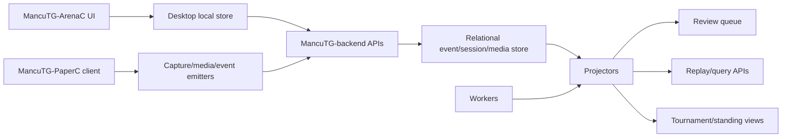

# feat: Roadmap the remaining MancuTG-Companion implementation work

## Summary

Dieses Dokument fasst den aktuellen Implementierungsstand von MancuTG-Companion zusammen und priorisiert die noch offenen Arbeiten neu. MancuTG-ArenaC wird als erstes vollstaendiges Produkt bis zum MVP-/Release-Stand vorgezogen; MancuTG-PaperC bleibt bis dahin bewusst auf Contract-/Skeleton-Niveau. Das Dokument dient damit als Konsolidierungsplan ueber MancuTG-ArenaC, MancuTG-backend und MancuTG-PaperC hinweg, ohne die ArenaC-MVP-Prioritaet zu verlieren.

---

## Problem Frame

Der aktuelle Stand des Repos ist deutlich ueber einer reinen Foundations-Basis: gemeinsame Event-/Session-Vertraege, ein startbarer MancuTG-backend-Server, iOS-Offline-Import in MancuTG-ArenaC, PaperC-spezifische Event-/Tournament-/Media-Vertraege sowie file-basierte Persistenz sind bereits vorhanden. Gleichzeitig fehlen noch die Schichten, die aus diesen Foundations ein vollstaendiges Produkt machen: echte GUI-Oberflaechen, PaperC-Clientpfade, Review-/Projektionslogik, Worker-Partitionierung fuer gleichzeitige Spiele, relationale Persistenz, Auth und nutzbare Abfrage-APIs.

Ohne diese naechsten Bausteine bleibt die Architektur tragfaehig, aber fuer Endnutzer, Turnierbetrieb und laengerfristigen Serverbetrieb nur teilweise nutzbar. Gleichzeitig waere es strategisch falsch, MancuTG-PaperC bereits in umfangreiche Detection-, Review-, Tournament- oder Worker-Logik auszubauen, bevor MancuTG-ArenaC als erstes Produkt stabil ist. Die zentrale Aufgabe ist deshalb jetzt nicht mehr „ob“ MancuTG-Companion technisch moeglich ist, sondern **wie ArenaC zuerst produktreif abgeschlossen und PaperC bis dahin bewusst schlank gehalten wird**.

---

## Current Implemented Baseline

### Bereits vorhanden und funktional

- gemeinsame Session-/Event-Batchvertraege fuer MancuTG-ArenaC, MancuTG-PaperC und MancuTG-backend
- PaperC-spezifische Shared Contracts in:
  - `packages/shared-schema/src/paperc.ts`
  - `packages/shared-schema/src/tournaments.ts`
  - `packages/shared-schema/src/media.ts`
- startbarer MancuTG-backend-Server mit:
  - `POST /events`
  - `POST /media/sessions`
  - `POST /sync`
  - `GET /health`
  - `GET /integrations/archidekt/:deckId`
- file-basierte persistente Speicherung fuer Sessions, Events und Media-Metadaten
- MancuTG-ArenaC-CLI fuer lokale Arena-Log-Workflows
- iOS/iPadOS-Offline-Importpfad in MancuTG-ArenaC
- Archidekt read-only Connector
- durchgehende TS-/Rust-/Python-Testabdeckung fuer diese Foundations

### Noch nicht produktvollstaendig

- kein echter MTGA-Detailed-Log-Parser fuer MancuTG-ArenaC
- kein Live-Log-Watcher mit Checkpointing fuer MancuTG-ArenaC
- keine echte Tauri-/React-Oberflaeche fuer MancuTG-ArenaC
- keine vollstaendigen lokalen Read Models / Export-/Reprocessing-Flows fuer reale MTGA-Logs
- keine Privacy-/Settings-/Consent-Oberflaechen fuer MancuTG-ArenaC
- keine gehärtete Archidekt-Read-only-MVP-Produktintegration
- kein MVP-Release-Hardening fuer MancuTG-ArenaC
- kein minimales PaperC-Client-Skelett zur echten Contract-Validierung
- keine Review-Queue oder Korrekturprojektoren im Backend
- keine Turnier-/Match-Projektoren fuer mehrere gleichzeitige Spiele
- keine echte Worker-Laufzeit fuer Detection/Review/Finalize
- keine relationale Produktivpersistenz oder Cursor-/Pull-Sync
- keine Auth-/Rollenmodelle
- keine Replay-/Query-APIs
- keine Web-/Sharing-/Team-Flaechen

---

## Remaining Implementations

Die noch offenen Implementierungen werden ab jetzt in dieser Prioritaet behandelt:

1. **U0 Repository verification and CI hardening**
   - Toolchain/README/CI als verlaessliche Basis

2. **U1a Shared backend contract stabilization**
   - gemeinsame Contracts, Dedupe, Idempotenz, API-Haertung

3. **U2 Minimal MancuTG-PaperC contract skeleton**
   - nur Contract-/Client-Skeleton, keine produktive Video-/Reviewlogik

4. **U1b ArenaC real MTGA detailed-log parser**
   - echter MTGA-Detailed-Log-Korpus und Parser-Haertung

5. **U1c ArenaC live watcher and checkpointing**
   - inkrementelles Beobachten realer Logs

6. **U1d ArenaC local read models, export and reprocessing**
   - lokale produktreife Datenansichten und Export

7. **U1 MancuTG-ArenaC application shell**
   - echte Tauri-/React-UI

8. **U1e ArenaC privacy, settings and consent enforcement**
   - Privacy Center und Settings als echte Produktflaeche

9. **U1f Archidekt read-only MVP hardening**
   - produktionsnahe Read-only Integration

10. **U1g ArenaC MVP polish and release hardening**
    - Packaging, Smoke, Nutzerdoku

11. **Deferred PaperC Phase A — Review & Correction Backend**
12. **Deferred PaperC Phase B — Concurrent Game Runtime**
13. **Deferred PaperC Phase C — Relational Backend Persistence**
14. **Deferred PaperC Phase D — Auth / Roles / Permissions**
15. **Deferred PaperC Phase E — Read APIs / Replay / Tournament Queries**
16. **Deferred PaperC Phase F — Detection / Video Pipeline**
17. **Later Product Expansions**
    - MancuTG-ArenaC Overlay/HUD
    - Web profile / sharing
    - Team-/Coach-Funktionen
    - bidirektionale Archidekt-Flows
    - Broadcast/Replay UX

---

## Requirements

- R1. Die offenen Implementierungen muessen ueber ArenaC, backend und PaperC konsistent und priorisiert aufgelistet werden.
- R2. Der Plan muss zwischen bereits funktionalen Foundations und noch fehlenden Produktflaechen unterscheiden.
- R3. Die naechsten Schritte muessen eine sinnvolle Lieferreihenfolge haben, die auf dem aktuellen Repozustand aufbaut.
- R4. MancuTG-backend darf frueh nur soweit ausgebaut werden, wie ArenaC-MVP und gemeinsame Contracts es benoetigen; umfangreiche PaperC-Betriebslogik wird bewusst nach hinten verschoben.
- R5. MancuTG-PaperC muss vor ArenaC-MVP nur als minimales Contract-Skeleton eingeplant werden, nicht als vollwertige Produktimplementierung.
- R6. Die Roadmap darf die vorhandenen Offline-first-, read-only- und app-uebergreifenden Eventinvarianten nicht verletzen.

---

## Scope Boundaries

- Dieses Dokument beschreibt den offenen Implementierungsbedarf und die empfohlene Umsetzungsreihenfolge; es implementiert die fehlenden Features nicht selbst.
- Es ersetzt nicht die bestehenden Detailplaene fuer Foundations oder PaperC-Videoerkennung, sondern fasst sie in eine uebergeordnete Roadmap zusammen.

### Deferred to Follow-Up Work

- ML-Modelltraining und Datensatzaufbau
- Self-hosting-/Enterprise-Ausbau
- Produktmarketing, Packaging und Distribution ausserhalb der technischen Kernelemente

---

## Key Technical Decisions

- **ArenaC zuerst produktreif:** MancuTG-ArenaC bekommt Prioritaet bis zum MVP-/Release-Stand.
- **PaperC nur als Contract-/Skeleton-Level vor ArenaC-MVP:** Keine fruehe Detection-, Worker-, Review- oder Tournament-Produktlogik fuer PaperC.
- **Backend nur soweit frueh, wie ArenaC und Shared Contracts es brauchen:** Keine ueberfruehe Backend-Komplexitaet nur fuer spaetere PaperC-Faelle.
- **JSON-Store bleibt Zwischenstation:** relationale Persistenz wird erst nach ArenaC-MVP oder bei echtem PaperC-Betrieb vorgezogen.
- **Projektoren bleiben der Wahrheitsort:** Review-, Korrektur- und Turnierzustand gehoeren spaeter in Projektionen; rohe Events bleiben append-only.

---

## High-Level Technical Design

> *This illustrates the intended approach and is directional guidance for review, not implementation specification. The implementing agent should treat it as context, not code to reproduce.*

---

## Phased Delivery

### Phase 0 — Repository verification and CI hardening

**Goal:** Sicherstellen, dass der aktuelle Branch reproduzierbar gebaut, getestet und dokumentiert werden kann.

Includes:
- Toolchain-Dokumentation fuer Node, Rust, Python
- `npm ci`
- TypeScript-, Rust- und Python-Tests
- API-Server-Smoke-Test
- CI-Workflow-Pruefung
- README-Kommandos gegen echten Repo-Zustand verifizieren

### Phase 1 — Shared backend contract stabilization

**Goal:** Die app-uebergreifenden Contracts zwischen ArenaC, PaperC und backend sauber halten, ohne PaperC bereits produktiv auszubauen.

Includes:
- Event-/Session-Batchvertraege pruefen und haerten
- Dedupe-/Idempotenzverhalten absichern
- Media-Session-Vertraege beibehalten
- Backend-Endpunkte `/events`, `/media/sessions`, `/sync`, `/health` stabil halten

### Phase 2 — Minimal MancuTG-PaperC contract skeleton

**Goal:** PaperC nur soweit anlegen, dass die gemeinsamen Schnittstellen real validiert werden koennen.

Includes:
- `apps/paperc/` minimal anlegen
- Capture Session Builder
- Media Session Request Builder
- PaperC Event Builder
- Tournament Context Builder
- optionale einfache CLI-/Test-Emitter

Explicitly not included:
- keine Videoverarbeitung
- keine Detection Pipeline
- keine Review Queue
- keine Tournament Projectors
- keine Worker Runtime

### Phase 3 — ArenaC real MTGA detailed-log parser

**Goal:** ArenaC muss echte MTGA-Detailed-Logs verlaesslich verarbeiten koennen.

Includes:
- realistische MTGA-Detailed-Log-Beispiele als Testkorpus
- Golden Tests
- Parser-Erweiterung von Demoformat auf reale Logstrukturen
- parserVersion / Unknown-Event-Handling / Reprocessing-Grundlage

### Phase 4 — ArenaC live watcher and checkpointing

**Goal:** ArenaC wird vom Import-Tool zum echten Companion.

Includes:
- Live File Watcher
- inkrementelles Lesen
- persistente Checkpoints
- Log-Rotation / Truncation / Restart-Verhalten

### Phase 5 — ArenaC local read models, export and reprocessing

**Goal:** ArenaC soll lokal-first nutzbare Datenansichten bieten.

Includes:
- lokale Match-/Collection-/Inventory-/Draft-Queries
- Export JSON/CSV/optional Backup
- Reprocessing bestehender Raw Chunks
- Unknown-Event-/Import-Fehlerdiagnose

### Phase 6 — MancuTG-ArenaC application shell

**Goal:** ArenaC bekommt eine echte nutzbare Desktop-Oberflaeche.

Includes:
- Tauri/React App Shell
- Setup Wizard
- Log Path Detection / Picker
- Live Watcher Start/Stop
- iOS File/Folder Import
- Import Center
- Dashboard / History / Collection / Inventory / Draft / Export UI

### Phase 7 — ArenaC privacy, settings and consent enforcement

**Goal:** Offline-first und Datenschutz werden echte Produktflaechen.

Includes:
- Privacy Center UI
- Settings Persistenz
- Sync/Archidekt/Telemetry opt-in
- lokale Daten loeschen / exportieren
- klare Anzeige, was lokal bleibt und was gesendet wuerde

### Phase 8 — Archidekt read-only MVP hardening

**Goal:** Den vorhandenen Connector als read-only MVP sauber nutzbar machen.

Includes:
- echter Runtime-Fetcher
- Fehlerbehandlung
- Cache-/TTL-Entscheidungen
- ArenaC Import UI
- lokale Snapshot-Speicherung

### Phase 9 — ArenaC MVP polish and release hardening

**Goal:** ArenaC wird als erstes Produkt veroeffentlichungsfaehig.

Includes:
- Windows/macOS Build- und Bundle-Pruefung
- Smoke Tests auf frischem System
- Nutzer-README / Installationspfade
- Known Issues / Release Checklist

### Deferred PaperC Phase A — Review & Correction Backend

### Deferred PaperC Phase B — Concurrent Game Runtime

### Deferred PaperC Phase C — Relational backend persistence

### Deferred PaperC Phase D — Auth / Roles / Permissions

### Deferred PaperC Phase E — Read APIs / Replay / Tournament Queries

### Deferred PaperC Phase F — Detection / Video Pipeline

### Later product expansions

- MancuTG-ArenaC Overlay/HUD
- Web profile / sharing
- Team-/Coach-Funktionen
- bidirektionale Archidekt-Flows
- Broadcast/Replay UX

---

## Implementation Units

- U0. **Repository verification and CI hardening**

**Goal:** Toolchain, CI und README als belastbare Ausgangsbasis sichern.

**Requirements:** R1, R2, R3, R6

**Dependencies:** None

**Files:**
- Modify: `.github/workflows/ci.yml`
- Modify: `README.md`
- Modify: `package.json`

**Approach:**
- Existierende Kommandos, Tests und CI-Schritte gegen den echten Repozustand pruefen.
- API-Smoke und Rust-Absicherung in CI explizit halten.

**Test scenarios:**
- Happy path: alle vorhandenen Checks laufen lokal und in CI.
- Error path: README-Kommandos driften nicht vom echten Projektzustand.

**Verification:**
- CI ist verlasslicher Qualitaets-Gate.

---

- U1a. **Shared backend contract stabilization**

**Goal:** Die gemeinsamen backendseitigen Contracts stabil halten, ohne PaperC zu weit vorzuziehen.

**Requirements:** R1, R3, R4, R6

**Dependencies:** U0

**Files:**
- Modify: `packages/shared-schema/src/`
- Modify: `services/api/src/routes/`
- Modify: `services/api/tests/`

**Approach:**
- Event-/Session-/Media-Vertraege stabilisieren.
- Keine komplexe PaperC-Produktlogik, nur Contract-Haertung.

**Test scenarios:**
- Happy path: ArenaC- und PaperC-Skeleton-Payloads validieren.
- Edge case: Dedupe/Idempotenz bleiben stabil.

**Verification:**
- backendseitige Contracts sind fuer beide Apps verlässlich.

---

- U2. **Minimal MancuTG-PaperC contract skeleton**

**Goal:** MancuTG-PaperC nur als minimales Contract-Skeleton anlegen.

**Requirements:** R1, R3, R5, R6

**Dependencies:** U1a

**Files:**
- Create: `apps/paperc/src/index.ts`
- Create: `apps/paperc/src/capture/`
- Create: `apps/paperc/src/events/`
- Create: `apps/paperc/src/tournaments/`
- Test: `apps/paperc/tests/paperc-event-emission.spec.ts`

**Approach:**
- Nur Builder / Skeleton / Contract-Validation.
- Keine Detection-, Review-, Worker- oder Tournament-Produktlogik.

**Test scenarios:**
- Happy path: PaperC erzeugt gueltige Session-/Event-/Media-Requests.
- Error path: ohne Turnierkontext kein sendbarer Request.

**Verification:**
- PaperC validiert die Shared Contracts real, bleibt aber bewusst duenn.

---

- U1b. **ArenaC real MTGA detailed-log parser**

**Goal:** Den ArenaC-Parser von Demo-/synthetischem Format auf reale MTGA-Detailed-Logs ausrichten.

**Requirements:** R2, R3, R6

**Dependencies:** U1a

**Files:**
- Modify: `crates/core-parser/src/`
- Create: `crates/core-parser/tests/fixtures/`
- Modify: `crates/core-parser/tests/golden_logs.rs`

**Approach:**
- realistische MTGA-Detailed-Log-Fragmente als Korpus aufbauen.
- Parser schrittweise auf reale Logstrukturen erweitern.
- Unknown-Event-Pfad beibehalten.

**Execution note:** Add characterization coverage before widening parser behavior.

**Test scenarios:**
- Happy path: reale Match-/Inventory-/Draft-nahe Log-Fragmente werden erkannt.
- Edge case: teilweise unbekannte Abschnitte bleiben recoverable.
- Error path: kaputte Fragmente brechen nicht den ganzen Importpfad.

**Verification:**
- ArenaC verarbeitet nicht nur Demoformat, sondern echte MTGA-Detailed-Logs.

---

- U1c. **ArenaC live watcher and checkpointing**

**Goal:** ArenaC vom Import-Tool zum echten Live-Companion machen.

**Requirements:** R2, R3, R6

**Dependencies:** U1b

**Files:**
- Modify: `apps/desktop/src-tauri/src/`
- Test: `apps/desktop/src-tauri/tests/`

**Approach:**
- Live-Watcher, Checkpoints, Log-Rotation und Restart-Verhalten explizit modellieren.

**Test scenarios:**
- Happy path: Append nach Checkpoint.
- Edge case: Rotation/Truncation.
- Error path: invalider Pfad / leere Datei / teilweise Logzeilen.

**Verification:**
- ArenaC beobachtet reale Logs robust ohne Duplikate.

---

- U1d. **ArenaC local read models, export and reprocessing**

**Goal:** ArenaC lokal-first voll nutzbar machen.

**Requirements:** R2, R3, R6

**Dependencies:** U1c

**Files:**
- Modify: `apps/desktop/src/`
- Modify: `apps/desktop/tests/`
- Modify: `crates/core-store/`

**Approach:**
- Query-Layer fuer lokale Match-/Collection-/Inventory-/Draft-Daten vervollstaendigen.
- Export und Reprocessing produktnah machen.

**Test scenarios:**
- Happy path: lokale Queries.
- Happy path: Export JSON/CSV.
- Edge case: Reprocessing ueber vorhandene Raw Chunks.

**Verification:**
- ArenaC ist lokal ohne Backend sinnvoll nutzbar.

---

- U1. **MancuTG-ArenaC application shell**

**Goal:** Die bestehende Desktop-State-Logik an eine echte Tauri-/React-Oberflaeche binden.

**Requirements:** R2, R3, R6

**Dependencies:** U1d

**Files:**
- Create: `apps/desktop/src/app/`
- Create: `apps/desktop/src/components/`
- Modify: `apps/desktop/src/index.ts`
- Modify: `apps/desktop/src/routes/imports/index.ts`
- Test: `apps/desktop/tests/`

**Approach:**
- Die bereits vorhandenen Route-States als ViewModels nutzen.
- Dateiauswahl fuer Bootstrap und iOS-Import an den MancuTG-ArenaC-Kern anbinden.

**Patterns to follow:**
- `apps/desktop/src/routes/`
- `apps/desktop/src-tauri/src/main.rs`

**Test scenarios:**
- Happy path: Nutzer kann lokalen Arena-Import aus der GUI ausloesen.
- Happy path: Nutzer kann iOS-Ordnerimport aus der GUI ausloesen.
- Edge case: Leere Imports bleiben UX-seitig valide.
- Error path: Fehlende oder ungueltige Dateien liefern sichtbare Fehlerzustande.

**Verification:**
- MancuTG-ArenaC hat eine echte UI-Frontdoor statt nur CLI/State-Helper.

---

- U1e. **ArenaC privacy, settings and consent enforcement**

**Goal:** Privacy-/Consent-Grenzen als echte MancuTG-ArenaC-Produktflaechen ausrollen.

**Requirements:** R2, R3, R4, R6

**Dependencies:** U1

**Files:**
- Modify: `apps/desktop/src/routes/privacy/`
- Modify: `apps/desktop/src/routes/settings/`
- Modify: `apps/desktop/tests/`

**Approach:**
- Sync/Archidekt/Telemetry opt-in explizit in UI und Persistenz abbilden.

**Test scenarios:**
- Happy path: Standardzustand bleibt lokal/offline.
- Error path: keine unautorisierten Netzwerkpfade.

**Verification:**
- Datenschutz ist Produktverhalten, nicht nur Doku.

---

- U1f. **Archidekt read-only MVP hardening**

**Goal:** Die vorhandene Archidekt-Integration fuer ArenaC produktnah absichern.

**Requirements:** R3, R4, R6

**Dependencies:** U1e

**Files:**
- Modify: `services/archidekt-connector/`
- Modify: `services/api/src/routes/integrations/archidekt/`
- Modify: `apps/desktop/src/routes/decks/`
- Modify: `apps/desktop/tests/`

**Approach:**
- echten Produktpfad statt Dummy-/Demo-Integration sichern.
- Fehler und Cache-Verhalten klar abbilden.

**Test scenarios:**
- Happy path: read-only Deckimport.
- Error path: Netzwerk-/RateLimit-/NotFound-Faelle.
- Edge case: lokale Offline-Verfuegbarkeit nach Import.

**Verification:**
- Archidekt ist als read-only MVP fuer ArenaC nutzbar.

---

- U1g. **ArenaC MVP polish and release hardening**

**Goal:** MancuTG-ArenaC als erstes veroeffentlichungsfaehiges Produkt absichern.

**Requirements:** R2, R3, R6

**Dependencies:** U1f

**Files:**
- Modify: `README.md`
- Modify: `.github/workflows/ci.yml`
- Create: `docs/release/` 

**Approach:**
- Bundling, Startup ohne Dev-Umgebung, Installationspfade und Known Issues zusammenziehen.

**Test scenarios:**
- Happy path: Build- und Startup-Smokes.
- Error path: Dokumentation passt zu Build-/Run-Reality.

**Verification:**
- ArenaC ist als erstes Produkt real test- und veroeffentlichbar.

---

- Deferred PaperC Phase A. **Review and correction backend**

**Goal:** Unsichere oder widerspruechliche PaperC-Detektionen sicher verarbeiten.

**Requirements:** R3, R4, R5, R6

**Dependencies:** U2

**Files:**
- Create: `services/api/src/routes/review/`
- Create: `services/api/src/domain/paperc/reviewService.ts`
- Create: `services/api/src/projectors/`
- Test: `services/api/tests/paperc/review-flow.spec.ts`

**Approach:**
- Review-Entscheidungen und Korrekturen als eigene Ereignisse modellieren.
- Projektoren bauen den autoritativen Zustand aus Rohereignissen + Review auf.

**Patterns to follow:**
- `packages/shared-schema/src/paperc.ts`
- `services/api/src/routes/events.ts`

**Test scenarios:**
- Happy path: Low-confidence-Detection erzeugt Review.
- Happy path: Review-Resolved superseded ein Rohereignis.
- Edge case: widerspruechliche Produzenten fuehren zu Review statt stillem Overwrite.
- Error path: ungueltige Review-Entscheidung wird abgelehnt.

**Verification:**
- MancuTG-backend kann PaperC-Daten sicher von Rohdetektion zu autoritativem Zustand ueberfuehren.

---

- Deferred PaperC Phase B. **Concurrent game runtime and projectors**

**Goal:** Mehrere gleichzeitige Tische/Spiele robust ueber MancuTG-backend verarbeiten.

**Requirements:** R1, R3, R4, R6

**Dependencies:** Deferred PaperC Phase A

**Files:**
- Create: `services/worker/src/paperc/`
- Create: `services/api/src/routes/tournaments/`
- Create: `services/api/src/projectors/papercTournamentProjector.ts`
- Test: `services/api/tests/paperc/concurrent-games.spec.ts`

**Approach:**
- `matchStreamKey` und per-Stream-Partitionierung einfuehren.
- Within-stream ordering, cross-stream parallel.

**Patterns to follow:**
- `services/api/src/server.ts`
- `docs/plans/2026-05-06-003-feat-mancutg-paperc-tournament-video-detection-plan.md`

**Test scenarios:**
- Happy path: mehrere Tische parallel.
- Edge case: spaete Events nach Finalisierung.
- Edge case: Retry-Batches ohne doppelte Finalisierung.
- Error path: fehlende Streamidentitaet stoppt Verarbeitung.

**Verification:**
- Gleichzeitige Spiele ueberschreiben sich nicht gegenseitig.

---

- Deferred PaperC Phase C. **Relational backend persistence**

**Goal:** Die JSON-Store-Zwischenstufe auf dauerhafte relationale Persistenz heben.

**Requirements:** R1, R3, R4, R6

**Dependencies:** Deferred PaperC Phase A, Deferred PaperC Phase B

**Files:**
- Create: `services/api/src/domain/persistence/`
- Create: `services/api/src/migrations/`
- Modify: `services/api/src/domain/eventService.ts`
- Test: `services/api/tests/persistent-event-store.spec.ts`

**Approach:**
- Sessions, Events, MediaSessions, MediaArtifacts, idempotency keys relational speichern.
- File-backed Store danach als dev fallback optional belassen oder entfernen.

**Patterns to follow:**
- `services/api/src/domain/eventService.ts`

**Test scenarios:**
- Happy path: restart-safe persistence.
- Happy path: media and events share persisted references.
- Edge case: duplicate batch replay after restart.
- Error path: partial write rollback.

**Verification:**
- MancuTG-backend ist fuer laenger laufenden Mehrspielbetrieb persistent genug.

---

- Deferred PaperC Phase E. **Read APIs and replay/query surfaces**

**Goal:** Die gespeicherten Daten wieder fuer Produkte nutzbar machen.

**Requirements:** R2, R3, R6

**Dependencies:** Deferred PaperC Phase A, Deferred PaperC Phase B, Deferred PaperC Phase C

**Files:**
- Create: `services/api/src/routes/matches/`
- Create: `services/api/src/routes/replay/`
- Create: `services/api/tests/query/`

**Approach:**
- Match-, Round-, Tournament- und Replay-Abfragen auf Projektoren aufsetzen.

**Patterns to follow:**
- `services/api/src/routes/`

**Test scenarios:**
- Happy path: Matchzustand aus Eventlog lesen.
- Happy path: Replay-Timeline aus Events + Corrections ableiten.
- Edge case: reopened matches stay queryable with correction lineage.

**Verification:**
- ArenaC und PaperC koennen dieselben Backend-Daten wieder konsumieren.

---

## New Priority Order

1. U0 Repository verification and CI hardening
2. U1a Shared backend contract stabilization
3. U2 Minimal MancuTG-PaperC contract skeleton
4. U1b ArenaC real MTGA detailed-log parser
5. U1c ArenaC live watcher and checkpointing
6. U1d ArenaC local read models, export and reprocessing
7. U1 MancuTG-ArenaC application shell
8. U1e ArenaC privacy, settings and consent enforcement
9. U1f Archidekt read-only MVP hardening
10. U1g ArenaC MVP polish and release hardening
11. Deferred PaperC Phase A — Review & Correction Backend
12. Deferred PaperC Phase B — Concurrent Game Runtime
13. Deferred PaperC Phase C — Relational Backend Persistence
14. Deferred PaperC Phase D — Auth / Roles / Permissions
15. Deferred PaperC Phase E — Read APIs / Replay / Tournament Queries
16. Deferred PaperC Phase F — Detection / Video Pipeline
17. Later Product Expansions

---

## System-Wide Impact

- **Interaction graph:** ArenaC reaches MVP first while PaperC remains a contract-validating skeleton on the same backend foundations.
- **Error propagation:** Parser-, watcher-, and UI-errors in ArenaC must be solved before backend and PaperC complexity scales further.
- **State lifecycle risks:** the highest near-term risks are still parser correctness, watcher duplication, consent gating, and release hardening for ArenaC.
- **API surface parity:** `/events` and `/media/sessions` remain the shared cross-app foundation, but PaperC product logic is intentionally deferred.
- **Unchanged invariants:** ArenaC remains local-first; PaperC remains a separate app; backend remains optional for ArenaC-only local use.

---

## Risks & Dependencies

| Risk | Mitigation |
|------|------------|
| ArenaC MVP slips while PaperC complexity grows too early | hard-prioritize ArenaC parser, watcher, UI, privacy and release work first |
| PaperC client invents its own semantics | keep `paperc.ts`, `tournaments.ts`, and `media.ts` as single sources of truth and keep PaperC skeleton-thin |
| Real MTGA logs differ from synthetic assumptions | build a real Detailed-Log corpus and golden tests before UI polish |
| JSON store becomes a hidden production dependency | defer relational persistence explicitly and avoid treating the JSON store as final architecture |
| Review/runtime complexity grows before ArenaC is stable | defer PaperC review, worker, tournament and detection phases until ArenaC MVP is complete |

---

## Documentation / Operational Notes

- README should be updated whenever a new end-user-visible ArenaC path becomes real.
- Once relational persistence lands, the architecture and privacy docs should stop presenting the file-backed store as the primary runtime shape.
- The next implementation work after this roadmap should start with **U0 + U1a + U2 + U1b**, not with PaperC review/runtime phases.

---

## Sources & References

- Related code: `README.md`
- Related code: `docs/architecture/unified-mtg-companion-architecture.md`
- Related code: `docs/plans/2026-05-06-001-feat-unified-mtg-companion-platform-plan.md`
- Related code: `docs/plans/2026-05-06-002-feat-foundation-functionalization-plan.md`
- Related code: `docs/plans/2026-05-06-003-feat-mancutg-paperc-tournament-video-detection-plan.md`
- Related code: `docs/plans/2026-05-07-001-feat-app-spanning-event-model-plan.md`
