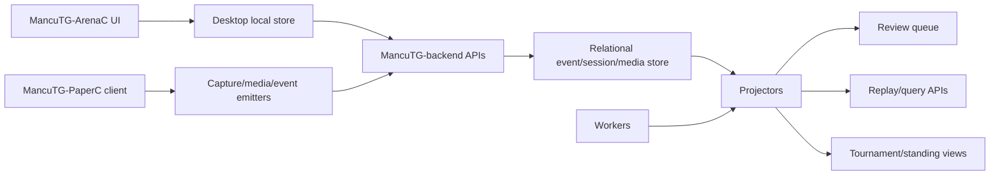

# feat: Roadmap the remaining MancuTG-Companion implementation work

## Summary

Dieses Dokument fasst den aktuellen Implementierungsstand von MancuTG-Companion zusammen und listet die noch offenen Arbeiten in einer umsetzbaren Reihenfolge auf. Es dient als Konsolidierungsplan ueber MancuTG-ArenaC, MancuTG-backend und MancuTG-PaperC hinweg, damit die naechsten Schritte nicht als isolierte Einzelaufgaben, sondern als zusammenhaengende Roadmap umgesetzt werden.

---

## Problem Frame

Der aktuelle Stand des Repos ist deutlich ueber einer reinen Foundations-Basis: gemeinsame Event-/Session-Vertraege, ein startbarer MancuTG-backend-Server, iOS-Offline-Import in MancuTG-ArenaC, PaperC-spezifische Event-/Tournament-/Media-Vertraege sowie file-basierte Persistenz sind bereits vorhanden. Gleichzeitig fehlen noch die Schichten, die aus diesen Foundations ein vollstaendiges Produkt machen: echte GUI-Oberflaechen, PaperC-Clientpfade, Review-/Projektionslogik, Worker-Partitionierung fuer gleichzeitige Spiele, relationale Persistenz, Auth und nutzbare Abfrage-APIs.

Ohne diese naechsten Bausteine bleibt die Architektur tragfaehig, aber fuer Endnutzer, Turnierbetrieb und laengerfristigen Serverbetrieb nur teilweise nutzbar. Die zentrale Aufgabe ist deshalb jetzt nicht mehr „ob“ MancuTG-Companion technisch moeglich ist, sondern **welche offenen Implementierungen in welcher Reihenfolge den groessten Produktfortschritt liefern**.

---

## Current Implemented Baseline

### Bereits vorhanden und funktional

- gemeinsame Session-/Event-Batchvertraege fuer MancuTG-ArenaC, MancuTG-PaperC und MancuTG-backend
- PaperC-spezifische Shared Contracts in:
  - `packages/shared-schema/src/paperc.ts`
  - `packages/shared-schema/src/tournaments.ts`
  - `packages/shared-schema/src/media.ts`
- startbarer MancuTG-backend-Server mit:
  - `POST /events`
  - `POST /media/sessions`
  - `POST /sync`
  - `GET /health`
  - `GET /integrations/archidekt/:deckId`
- file-basierte persistente Speicherung fuer Sessions, Events und Media-Metadaten
- MancuTG-ArenaC-CLI fuer lokale Arena-Log-Workflows
- iOS/iPadOS-Offline-Importpfad in MancuTG-ArenaC
- Archidekt read-only Connector
- durchgehende TS-/Rust-/Python-Testabdeckung fuer diese Foundations

### Noch nicht produktvollstaendig

- keine echte Tauri-/React-Oberflaeche fuer MancuTG-ArenaC
- kein PaperC-Client-Skelett mit Capture-/Emit-/Review-Frontdoor
- keine Review-Queue oder Korrekturprojektoren im Backend
- keine Turnier-/Match-Projektoren fuer mehrere gleichzeitige Spiele
- keine echte Worker-Laufzeit fuer Detection/Review/Finalize
- keine relationale Produktivpersistenz oder Cursor-/Pull-Sync
- keine Auth-/Rollenmodelle
- keine Replay-/Query-APIs
- keine Web-/Sharing-/Team-Flaechen

---

## Remaining Implementations

Die noch offenen Implementierungen gruppieren sich in acht Bloecke:

1. **MancuTG-ArenaC GUI / App-Shell**
   - Tauri-Windowing
   - React-Routen auf den existierenden Desktop-State binden
   - Datei-/Ordner-Picker fuer lokale Logs und iOS-Import

2. **MancuTG-PaperC Client Skeleton**
   - App-Skelett unter `apps/paperc/`
   - Capture-Session-Erstellung
   - Eventemission gegen `/events`
   - Media-Session-Erstellung gegen `/media/sessions`

3. **Review-/Correction-Backend**
   - Review-Routen
   - Review-Queue-State
   - Review-/Correction-/Finalization-Projektoren

4. **Tournament / Concurrent Game Runtime**
   - `matchStreamKey`
   - Partitionierung fuer mehrere gleichzeitige Tische/Spiele
   - Worker-Runtime fuer Detect / Review / Finalize

5. **Persistente Server-Schicht**
   - Wechsel von file-backed JSON zu relationaler Persistenz
   - Session-/Event-/Media-Tabellen
   - Idempotenz-/Cursor-Speicherung

6. **Auth / Roles / Permissions**
   - ingest devices
   - reviewers / judges
   - admins / tournament operators

7. **Read APIs / Replay / Queries**
   - Match-/Round-/Tournament-Abfragen
   - Replay-/Timeline-Abfragen
   - Query-Endpunkte fuer ArenaC und PaperC

8. **Produktoberflaechen nach dem Kern**
   - Web profile / sharing
   - Team-/Coach-Funktionen
   - MancuTG-ArenaC Overlay/HUD
   - bidirektionale Archidekt-Flows

---

## Requirements

- R1. Die offenen Implementierungen muessen ueber ArenaC, backend und PaperC konsistent und priorisiert aufgelistet werden.
- R2. Der Plan muss zwischen bereits funktionalen Foundations und noch fehlenden Produktflaechen unterscheiden.
- R3. Die naechsten Schritte muessen eine sinnvolle Lieferreihenfolge haben, die auf dem aktuellen Repozustand aufbaut.
- R4. MancuTG-backend muss frueh fuer Review, Parallelitaet und relationale Persistenz vorbereitet werden, bevor aufwaendige UI- oder Modellarbeit zu viele Annahmen festbrennt.
- R5. MancuTG-PaperC muss als echter Clientpfad priorisiert werden, weil die bestehenden Shared Contracts sonst ungenutzt bleiben.
- R6. Die Roadmap darf die vorhandenen Offline-first-, read-only- und app-uebergreifenden Eventinvarianten nicht verletzen.

---

## Scope Boundaries

- Dieses Dokument beschreibt den offenen Implementierungsbedarf und die empfohlene Umsetzungsreihenfolge; es implementiert die fehlenden Features nicht selbst.
- Es ersetzt nicht die bestehenden Detailplaene fuer Foundations oder PaperC-Videoerkennung, sondern fasst sie in eine uebergeordnete Roadmap zusammen.

### Deferred to Follow-Up Work

- ML-Modelltraining und Datensatzaufbau
- Self-hosting-/Enterprise-Ausbau
- Produktmarketing, Packaging und Distribution ausserhalb der technischen Kernelemente

---

## Key Technical Decisions

- **Backend vor UI-Schmuck:** MancuTG-backend muss zuerst Review-, Parallelitaets- und Persistenzgrenzen sauber bekommen, bevor MancuTG-ArenaC- oder MancuTG-PaperC-UIs zu viele Workflowannahmen verfestigen.
- **PaperC frueh, aber schlank:** Ein minimales `apps/paperc/`-Skelett ist wichtiger als sofortige komplexe Visionarbeit, weil es die Shared Contracts real nutzbar macht.
- **JSON-Store ist nur Zwischenstation:** Die file-basierte Persistenz war der richtige Foundations-Schritt, darf aber nicht Endzustand fuer Multi-Game-/Reviewbetrieb bleiben.
- **Projektoren sind der Wahrheitsort:** Review-, Korrektur- und Turnierzustand gehoeren in Projektionen; rohe Events bleiben append-only.
- **ArenaC- und PaperC-Paritaet auf Contract-Ebene vor UI-Paritaet:** Bevor beide Produkte visuell ausgearbeitet werden, muessen sie denselben Session-/Event-/Media-Kern wirklich nutzen.

---

## High-Level Technical Design

> *This illustrates the intended approach and is directional guidance for review, not implementation specification. The implementing agent should treat it as context, not code to reproduce.*

---

## Phased Delivery

### Phase 1 — Use the existing contracts in real client flows

**Goal:** MancuTG-ArenaC and MancuTG-PaperC should both drive the backend through real product entrypoints.

Includes:
- MancuTG-ArenaC Tauri/React shell
- local log and iOS import UI binding
- `apps/paperc/` skeleton
- `/events` + `/media/sessions` usage from PaperC client code

Why first:
- validates current contracts end-to-end
- exposes UX and contract gaps early
- avoids overbuilding backend workflows nobody can exercise yet

### Phase 2 — Review and tournament truth

**Goal:** make PaperC eventing operationally safe.

Includes:
- review queue routes
- correction/finalization routes
- review/correction/tournament projectors
- worker partitioning via `matchStreamKey`

Why second:
- concurrent games become meaningful only when detections can be reviewed and projected safely

### Phase 3 — Production-grade backend persistence

**Goal:** replace file-backed runtime with durable multi-process storage.

Includes:
- relational persistence
- sessions/events/media tables
- idempotency tables
- cursor / pull-sync groundwork

Why third:
- once client and review flows stabilize, storage can be normalized against real usage

### Phase 4 — Read models and replay APIs

**Goal:** expose the captured state back to products and users.

Includes:
- match query API
- round/tournament query API
- replay/timeline API
- PaperC and ArenaC consumer adapters

### Phase 5 — Product expansions

Includes:
- overlay/HUD
- sharing/web/team features
- richer Archidekt flows
- broadcast/replay UX

---

## Implementation Units

- U1. **MancuTG-ArenaC application shell**

**Goal:** Die bestehende Desktop-State-Logik an eine echte Tauri-/React-Oberflaeche binden.

**Requirements:** R2, R3, R6

**Dependencies:** None

**Files:**
- Create: `apps/desktop/src/app/`
- Create: `apps/desktop/src/components/`
- Modify: `apps/desktop/src/index.ts`
- Modify: `apps/desktop/src/routes/imports/index.ts`
- Test: `apps/desktop/tests/`

**Approach:**
- Die bereits vorhandenen Route-States als ViewModels nutzen.
- Dateiauswahl fuer Bootstrap und iOS-Import an den MancuTG-ArenaC-Kern anbinden.

**Patterns to follow:**
- `apps/desktop/src/routes/`
- `apps/desktop/src-tauri/src/main.rs`

**Test scenarios:**
- Happy path: Nutzer kann lokalen Arena-Import aus der GUI ausloesen.
- Happy path: Nutzer kann iOS-Ordnerimport aus der GUI ausloesen.
- Edge case: Leere Imports bleiben UX-seitig valide.
- Error path: Fehlende oder ungueltige Dateien liefern sichtbare Fehlerzustande.

**Verification:**
- MancuTG-ArenaC hat eine echte UI-Frontdoor statt nur CLI/State-Helper.

---

- U2. **MancuTG-PaperC client skeleton**

**Goal:** MancuTG-PaperC als echten Clientpfad anschliessen.

**Requirements:** R1, R3, R5, R6

**Dependencies:** None

**Files:**
- Create: `apps/paperc/src/index.ts`
- Create: `apps/paperc/src/capture/`
- Create: `apps/paperc/src/events/`
- Create: `apps/paperc/src/tournaments/`
- Test: `apps/paperc/tests/paperc-event-emission.spec.ts`

**Approach:**
- Noch keine volle Vision-Pipeline, aber Capture-/Session-/Emit-Struktur.
- `/events` und `/media/sessions` direkt nutzen.

**Patterns to follow:**
- `apps/desktop/src/index.ts`
- `packages/shared-schema/src/paperc.ts`
- `packages/shared-schema/src/media.ts`

**Test scenarios:**
- Happy path: PaperC erzeugt gueltige Session-/Event-/Media-Requests.
- Edge case: unterschiedliche Capture-Sessions erzeugen unterschiedliche Streamidentitaeten.
- Error path: ohne Turnier-/Matchkontext kein sendbarer Request.

**Verification:**
- MancuTG-PaperC ist als Clientpfad nicht mehr nur dokumentiert, sondern lauffaehig angeschlossen.

---

- U3. **Review and correction backend**

**Goal:** Unsichere oder widerspruechliche PaperC-Detektionen sicher verarbeiten.

**Requirements:** R3, R4, R5, R6

**Dependencies:** U2

**Files:**
- Create: `services/api/src/routes/review/`
- Create: `services/api/src/domain/paperc/reviewService.ts`
- Create: `services/api/src/projectors/`
- Test: `services/api/tests/paperc/review-flow.spec.ts`

**Approach:**
- Review-Entscheidungen und Korrekturen als eigene Ereignisse modellieren.
- Projektoren bauen den autoritativen Zustand aus Rohereignissen + Review auf.

**Patterns to follow:**
- `packages/shared-schema/src/paperc.ts`
- `services/api/src/routes/events.ts`

**Test scenarios:**
- Happy path: Low-confidence-Detection erzeugt Review.
- Happy path: Review-Resolved superseded ein Rohereignis.
- Edge case: widerspruechliche Produzenten fuehren zu Review statt stillem Overwrite.
- Error path: ungueltige Review-Entscheidung wird abgelehnt.

**Verification:**
- MancuTG-backend kann PaperC-Daten sicher von Rohdetektion zu autoritativem Zustand ueberfuehren.

---

- U4. **Concurrent game runtime and projectors**

**Goal:** Mehrere gleichzeitige Tische/Spiele robust ueber MancuTG-backend verarbeiten.

**Requirements:** R1, R3, R4, R6

**Dependencies:** U3

**Files:**
- Create: `services/worker/src/paperc/`
- Create: `services/api/src/routes/tournaments/`
- Create: `services/api/src/projectors/papercTournamentProjector.ts`
- Test: `services/api/tests/paperc/concurrent-games.spec.ts`

**Approach:**
- `matchStreamKey` und per-Stream-Partitionierung einfuehren.
- Within-stream ordering, cross-stream parallel.

**Patterns to follow:**
- `services/api/src/server.ts`
- `docs/plans/2026-05-06-003-feat-mancutg-paperc-tournament-video-detection-plan.md`

**Test scenarios:**
- Happy path: mehrere Tische parallel.
- Edge case: spaete Events nach Finalisierung.
- Edge case: Retry-Batches ohne doppelte Finalisierung.
- Error path: fehlende Streamidentitaet stoppt Verarbeitung.

**Verification:**
- Gleichzeitige Spiele ueberschreiben sich nicht gegenseitig.

---

- U5. **Relational backend persistence**

**Goal:** Die JSON-Store-Zwischenstufe auf dauerhafte relationale Persistenz heben.

**Requirements:** R1, R3, R4, R6

**Dependencies:** U3, U4

**Files:**
- Create: `services/api/src/domain/persistence/`
- Create: `services/api/src/migrations/`
- Modify: `services/api/src/domain/eventService.ts`
- Test: `services/api/tests/persistent-event-store.spec.ts`

**Approach:**
- Sessions, Events, MediaSessions, MediaArtifacts, idempotency keys relational speichern.
- File-backed Store danach als dev fallback optional belassen oder entfernen.

**Patterns to follow:**
- `services/api/src/domain/eventService.ts`

**Test scenarios:**
- Happy path: restart-safe persistence.
- Happy path: media and events share persisted references.
- Edge case: duplicate batch replay after restart.
- Error path: partial write rollback.

**Verification:**
- MancuTG-backend ist fuer laenger laufenden Mehrspielbetrieb persistent genug.

---

- U6. **Read APIs and replay/query surfaces**

**Goal:** Die gespeicherten Daten wieder fuer Produkte nutzbar machen.

**Requirements:** R2, R3, R6

**Dependencies:** U3, U4, U5

**Files:**
- Create: `services/api/src/routes/matches/`
- Create: `services/api/src/routes/replay/`
- Create: `services/api/tests/query/`

**Approach:**
- Match-, Round-, Tournament- und Replay-Abfragen auf Projektoren aufsetzen.

**Patterns to follow:**
- `services/api/src/routes/`

**Test scenarios:**
- Happy path: Matchzustand aus Eventlog lesen.
- Happy path: Replay-Timeline aus Events + Corrections ableiten.
- Edge case: reopened matches stay queryable with correction lineage.

**Verification:**
- ArenaC und PaperC koennen dieselben Backend-Daten wieder konsumieren.

---

## System-Wide Impact

- **Interaction graph:** ArenaC, PaperC, backend projectors, review flows and media ingest all converge on one backend domain model.
- **Error propagation:** Schema-, session-, and stream-validation must fail early so bad ingest does not poison downstream projections.
- **State lifecycle risks:** the biggest remaining risks are still review correctness, multi-stream ordering, and moving from file-backed persistence to production persistence.
- **API surface parity:** `/events` and `/media/sessions` remain the shared cross-app foundation; future routes should build on projections, not bypass the model.
- **Unchanged invariants:** ArenaC remains local-first; PaperC remains a separate app; backend remains optional for ArenaC-only local use.

---

## Risks & Dependencies

| Risk | Mitigation |
|------|------------|
| UI work drifts from backend contracts | bind UI to shared schema exports and integration tests early |
| PaperC client invents its own semantics | keep `paperc.ts`, `tournaments.ts`, and `media.ts` as single sources of truth |
| JSON store becomes a hidden production dependency | prioritize relational persistence before heavy tournament rollout |
| Review workflow stays underspecified | implement review/correction projectors before broad PaperC capture expansion |
| Multi-stream runtime complexity grows faster than tests | add concurrent-game tests before scaling worker logic |

---

## Documentation / Operational Notes

- README should be updated whenever a new end-user-visible product path becomes real.
- Once relational persistence lands, the architecture and privacy docs should stop presenting the file-backed store as the primary runtime shape.
- The next implementation plan after this roadmap should likely target **U2 + U3 together**, because PaperC capture without review semantics is unsafe.

---

## Sources & References

- Related code: `README.md`
- Related code: `docs/architecture/unified-mtg-companion-architecture.md`
- Related code: `docs/plans/2026-05-06-001-feat-unified-mtg-companion-platform-plan.md`
- Related code: `docs/plans/2026-05-06-002-feat-foundation-functionalization-plan.md`
- Related code: `docs/plans/2026-05-06-003-feat-mancutg-paperc-tournament-video-detection-plan.md`
- Related code: `docs/plans/2026-05-07-001-feat-app-spanning-event-model-plan.md`
