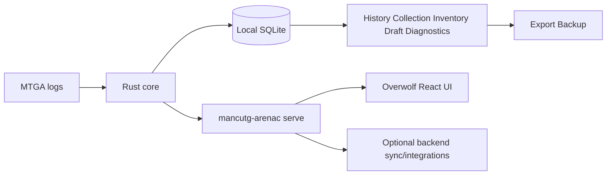

# plan: MancuTG-Companion architecture

## Goal

Keep one architecture plan that aligns historical architecture intent with the current Overwolf-first ArenaC MVP path.

## System boundaries

- **Client/core boundary**: Rust core (`parser`, `watcher`, `store`) remains authoritative.
- **Presentation boundary**: shell adapters (Overwolf now; Tauri possible later).
- **Service boundary**: backend is additive and never required for baseline local workflows.
- **Integration boundary**: third-party systems (Archidekt, media sources) via adapters.

## Runtime topology (current)

## Architecture invariants

- Same event contract across ArenaC, PaperC, backend producers.
- Idempotency and dedupe are protocol-level, not UI-level.
- Privacy gates network-capable features; default posture remains local/offline.
- Projectors produce read/query states; raw events remain immutable history.

## Compatibility and evolution

- Overwolf shell is implementation choice, not domain model dependency.
- PaperC adds capture/review/tournament domains without forking the base contract.
- Backend can move from JSON persistence to relational persistence without breaking producer contracts.

## Source references

- Detailed architecture narrative: `docs/architecture/unified-mtg-companion-architecture.md`
- Shell decision: `docs/plans/2026-05-07-003-decision-arenac-overwolf-windows-shell.md`
