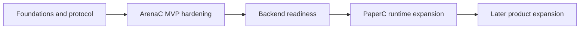

# plan: implementation roadmap

## Goal

Maintain one concise, current implementation roadmap aligned with latest decisions.

## Current status baseline

- Foundation/core modules exist and are test-covered.
- ArenaC has CLI + service mode + Overwolf windowed UI path.
- Shared app-spanning event contract exists and is in backend ingest.
- PaperC remains intentionally shallow pre-ArenaC completion.

## Phase roadmap

### Phase R0 (completed): foundations and cross-app event contract

- Foundational crates/services/packages established.
- Shared event/session batch protocol implemented.

### Phase R1 (in progress): ArenaC MVP hardening (Windows-first)

- Overwolf setup/main experience stability.
- `mancutg-arenac serve` reliability and smoke coverage.
- Release-grade docs/checklists/install guidance.
- Remaining acceptance items tracked in `docs/release/mancutg-arenac-mvp-checklist.md`.

### Phase R2 (next): backend readiness for expanded workflows

- Event/media ingest robustness and observability.
- Controlled persistence evolution planning (JSON -> relational).
- API surface preparation for review/projector pipeline.

### Phase R3 (deferred until ArenaC MVP exit): PaperC runtime expansion

- Detection/review pipeline.
- Concurrent tournament stream processing.
- Tournament query/replay APIs.
- Roles/permissions model.

### Phase R4 (later product expansion)

- ArenaC overlay/HUD.
- Sharing/team/coaching product surfaces.
- Bidirectional integrations.

## Dependency ordering

## Governance

- This file is the only active roadmap reference.
