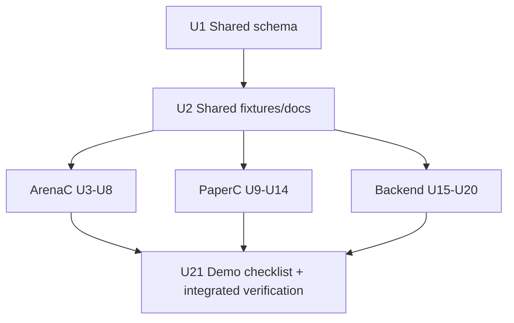

# feat: ArenaC + PaperC + Backend MVP hardening

## Summary

This plan hardens the MVP delivery path from the review document into implementation-ready units with an explicit serial-to-parallel execution model. It lands shared contract edits first, then runs ArenaC, PaperC, and Backend workstreams in parallel, and closes with cross-system verification plus `DEMO_CHECKLIST.md`.

---

## Problem Frame

The origin review identifies that ArenaC is close to MVP but blocked by build/runtime packaging gaps, PaperC is not yet a standalone app, and the backend must move from JSON-only foundations to a generic ingest + read model suitable for ArenaC and PaperC. The deadline requires a focused P0/P1 hardening sequence that ships demonstrable behavior quickly without re-architecture.

---

## Assumptions

*This plan was authored without synchronous user confirmation. The items below are agent inferences that fill gaps in the input - un-validated bets that should be reviewed before implementation proceeds.*

- Variant A (exclude `apps/overwolf` from root `tsconfig.json`) is selected for deadline typecheck split.
- Sidecar uses fixed port `17890`; handshake-file dynamic port discovery is deferred.
- `ProcessManager.dll` is assumed not yet vendored; manual sidecar-start fallback remains mandatory.
- Backend SQLite path is greenfield for `/v1/ingest/batches` and read APIs while existing JSON `/events` flow remains for compatibility.
- Web UI is introduced as `services/web/` (Vite React app) proxying to `services/api` for deadline delivery.

---

## Requirements

- R1. Remove ArenaC build blockers (barrel cycle, root typecheck coupling, and Overwolf import fragility) so Overwolf build/typecheck are reproducible.
- R2. Fix ArenaC setup/runtime reliability (declared window restore flow, MTGA log path resolution/fallbacks, sidecar startup and fixed-port behavior with clear errors).
- R3. Make Overwolf package release-ready (manifest icon completeness, OPK packaging behavior, and Game-ID 21566 verification workflow).
- R4. Prepare ArenaC producer mode for generic backend ingestion (`POST /v1/ingest/batches`) with privacy-safe defaults.
- R5. Deliver PaperC as a standalone desktop app (`apps/paperc-desktop`) with live loop, durable local logging, export, and robust backend forwarding.
- R6. Harden PaperC event correctness (canonical card naming, zod runtime parse, deterministic timestamps, review-request/confirm flow).
- R7. Deliver backend generic ingestion with SQLite schema and idempotency/duplicate/partial-error semantics from origin contract.
- R8. Deliver backend read APIs + SSE and a minimal 5-page web UI (Dashboard, Sessions, Session Detail, Review Queue, Diagnostics).
- R9. Enforce privacy/security defaults (loopback bind, non-wildcard CORS outside dev, raw-log upload opt-in only).
- R10. Produce final `DEMO_CHECKLIST.md` covering origin acceptance criteria for ArenaC, PaperC, and Backend/WebUI.

---

## Scope Boundaries

- No OCR/ML model training, no "perfect" card recognition, and no cloud deployment before deadline.
- No multi-user auth productization; producer token stays optional but prepared.
- No dynamic handshake-port rollout in this deadline pass (fixed-port strategy only).
- No forced migration of legacy `/events` JSON store behavior; compatibility stays intact while new ingest path lands.

### Deferred to Follow-Up Work

- Handshake-file based dynamic service URL discovery replacing fixed-port coupling.
- Full native packaging layer for PaperC (Tauri/Electron installer depth beyond startable desktop app).
- Deeper media artifact pipeline (`/v1/media/*`) and generalized review tooling beyond MVP queue.

---

## Context & Research

### Relevant Code and Patterns

- Arena shell cycle location: `apps/desktop/src/app/buildArenaAppShellState.ts` currently imports from `../index`.
- Arena sidecar service and default log path: `apps/desktop/src-tauri/src/serve.rs`.
- Overwolf setup/main windows and manifest: `apps/overwolf/src/setup-window.tsx`, `apps/overwolf/src/main-window.tsx`, `apps/overwolf/public/manifest.json`.
- Existing OPK packaging script behavior: `scripts/package-overwolf.ps1`.
- PaperC runtime/event pipeline baseline: `apps/paperc/src/runtime/*`, `apps/paperc/src/events/builders.ts`.
- Existing backend and store model: `services/api/src/server.ts`, `services/api/src/routes/events.ts`, `services/api/src/domain/eventService.ts`.
- Shared schema surfaces used by all streams: `packages/shared-schema/src/events.ts`, `packages/shared-schema/src/paperc.ts`, `packages/shared-schema/src/index.ts`.

### Institutional Learnings

- Current plans `011`-`017` already establish Windows-first Overwolf MVP for ArenaC and offline-first product invariants.
- Existing root scripts and release docs show reproducibility matters for handoff (`npm run typecheck`, `npm run overwolf:build`, package script).

### External References

- Overwolf manifest and plugin model expectations for `extra-objects`, icon metadata, and OPK packaging conventions (as called out in origin).
- Wizards MTGA log path guidance (`.../Wizards Of The Coast/MTGA/player.log` with `player-prev.log` fallback).

---

## Key Technical Decisions

- Use a serial Workstream 0 for shared contract/schema edits, then parallelize ArenaC/PaperC/Backend to prevent merge collisions and contract drift.
- Choose root typecheck split Variant A now (`tsconfig` exclude + dedicated `typecheck:overwolf`), defer TS project references to later.
- Treat Process Manager startup as preferred but non-blocking: ship manual fallback UX regardless of DLL availability to keep deadline shippable.
- Keep fixed sidecar port `17890` for deadline; fail fast with explicit UI errors when port is unavailable.
- Introduce SQLite-backed ingest/read model as additive path (`/v1/ingest/batches` + read APIs) while preserving legacy `/events` behavior.
- Use consistent naming in docs/fixtures: product label `ArenaC` and binary/package identifier `mancutg-arenac`.
- Implement SQLite runtime via Node 22 built-in `node:sqlite` APIs to avoid deadline risk from native addon installation.
- Standardize ingest envelope in shared schema first so ArenaC and PaperC can integrate independently against one contract.

---

## Open Questions

### Resolved During Planning

- How to prevent parallel merge conflicts? Use Workstream 0 + file-overlap matrix + explicit serial dependencies.
- SQLite migration strategy? Treat new ingest/read backend as greenfield additive path, not destructive migration.
- SQLite runtime dependency choice? Use Node built-in `node:sqlite` with no new external native dependency.
- Sidecar startup risk handling? Always include manual command fallback messaging in setup window.

### Deferred to Implementation

- Exact shape/class name expected by bundled Process Manager plugin DLL in manifest `extra-objects`.
- Whether MTG Arena needs `game_events` subscription at MVP or can defer to launch targeting only after Windows validation.
- Final `services/web` deployment coupling (independent dev server vs static-served by API) after MVP integration test pass.

---

## Output Structure

```text
apps/
  paperc-desktop/
    package.json
    index.html
    tsconfig.json
    vite.config.ts
    src/
      main.tsx
      PaperCApp.tsx
      camera/
      logging/
      sync/
services/
  web/
    package.json
    index.html
    src/
      main.tsx
      pages/
        DashboardPage.tsx
        SessionsPage.tsx
        SessionDetailPage.tsx
        ReviewQueuePage.tsx
        DiagnosticsPage.tsx
```

---

## Implementation Units

### Workstream 0 / Pre-parallel shared edits

- U1. **Define shared ingest contract and types**

**Goal:** Add/adjust shared schema types for `POST /v1/ingest/batches`, review queue event types, and producer/game/session/event envelope fields consumed by all three streams.

**Requirements:** R4, R6, R7

**Dependencies:** None

**Files:**
- Modify: `packages/shared-schema/src/events.ts`
- Modify: `packages/shared-schema/src/paperc.ts`
- Modify: `packages/shared-schema/src/index.ts`
- Test: `apps/paperc/tests/runtime-pipeline.spec.ts`
- Test: `services/api/tests/events-contract.spec.ts`

**Approach:**
- Introduce/normalize batch envelope fields (`idempotencyKey`, `producer`, `game`, `session`, `events`) and idempotency identifiers needed by backend rules.
- Add PaperC review event typing alignment (`mtg.paper.review.requested`, `mtg.paper.card.observed.confirmed`) while preserving existing schema compatibility where feasible.
- Keep this unit additive-first to avoid breaking current consumers before stream-specific updates.

**Execution note:** Start with failing contract tests in API and PaperC to lock request/response shape before code changes.

**Patterns to follow:**
- Existing zod-first schema pattern in `packages/shared-schema/src/events.ts`
- Paperc contract enforcement style in `packages/shared-schema/src/paperc.ts`

**Test scenarios:**
- Happy path - shared schema parses a valid ArenaC ingest batch with one session and one event.
- Edge case - schema accepts event arrays with mixed optional actor/object/targets while preserving required core IDs.
- Error path - schema rejects missing `sourceEventId` and missing `producer.instanceId`.
- Integration - same fixture payload validates in both PaperC builder tests and backend route tests.

**Verification:**
- Shared-schema tests and downstream contract tests consume the same ingest fixture without ad-hoc field transforms.

---

- U2. **Publish cross-stream API contract fixtures**

**Goal:** Create canonical request/response fixtures and docs consumed by ArenaC, PaperC, and Backend units to prevent divergence.

**Requirements:** R4, R5, R7, R8

**Dependencies:** U1

**Files:**
- Create: `docs/contracts/ingest-batches-v1.md`
- Create: `services/api/tests/fixtures/ingest-batches/arenac-minimal.json`
- Create: `services/api/tests/fixtures/ingest-batches/paperc-minimal.json`
- Create: `services/api/tests/fixtures/ingest-batches/partial-error.json`

**Approach:**
- Encode idempotency and partial-error examples from origin into fixtures used by route/integration tests.
- Define authoritative response semantics for duplicate batch replay and per-event rejection reporting.

**Patterns to follow:**
- Existing API fixture-driven tests under `services/api/tests`

**Test scenarios:**
- Happy path - fixture round-trip produces `accepted > 0`, `duplicates = 0`, `rejected = 0`.
- Edge case - duplicate event within known producer/session increments duplicate count.
- Error path - invalid event payload maps to entry in `errors[]` without aborting whole batch.
- Integration - ArenaC and PaperC client adapters deserialize same response fixture shape.

**Verification:**
- Contract fixtures are referenced by tests in all three workstreams; no stream defines conflicting inline contract literals.

---

### ArenaC Workstream (U3-U8)

- U3. **Remove Arena shell barrel cycle**

**Goal:** Eliminate Overwolf build hang by replacing `../index` barrel imports with direct module imports.

**Requirements:** R1

**Dependencies:** U2

**Files:**
- Modify: `apps/desktop/src/app/buildArenaAppShellState.ts`
- Test: `apps/overwolf/tests/build-smoke.spec.ts`

**Approach:**
- Replace all route-state builder imports with direct source paths, including `buildHistoryRouteState` from `../lib/query/history`.
- Avoid re-export chains that pull app shell itself back through `apps/desktop/src/index.ts`.

**Execution note:** Add/maintain characterization build-smoke assertion first to capture current hang/failure before changing imports.

**Patterns to follow:**
- Direct route import style already used elsewhere in `apps/desktop/src/app/*`

**Test scenarios:**
- Happy path - `vite build` for Overwolf emits `dist/main.html`, `dist/setup.html`, and JS assets.
- Edge case - incremental rebuild after clean install still completes without unresolved cycle.
- Error path - if a direct import path is wrong, build fails fast with module resolution error (no hang).
- Integration - Overwolf `main-window.tsx` can still render `ArenaClientApp` using desktop sources after cycle removal.

**Verification:**
- Overwolf build no longer stalls and generated files appear in `apps/overwolf/dist`.

---

- U4. **Split root and Overwolf typecheck pipeline**

**Goal:** Make CI and local typecheck deterministic by separating root TS check from Overwolf TS check.

**Requirements:** R1

**Dependencies:** U2

**Files:**
- Modify: `package.json`
- Modify: `tsconfig.json`
- Modify: `apps/overwolf/src/main-window.tsx`
- Modify: `apps/overwolf/src/setup-window.tsx`
- Test: `apps/overwolf/tests/typecheck-scripts.spec.ts`

**Approach:**
- Add `typecheck:root`, `typecheck:overwolf`, and composed `typecheck` script.
- Apply Variant A by excluding `apps/overwolf/**/*.ts(x)` in root `tsconfig.json`.
- Harden Overwolf imports (relative or consistently resolvable path strategy) so `tsc -p apps/overwolf/tsconfig.json` succeeds.

**Patterns to follow:**
- Existing script naming and composition style in root `package.json`

**Test scenarios:**
- Happy path - `typecheck:root` passes with only root dependencies installed.
- Edge case - Overwolf typecheck runs from clean clone and installs only `apps/overwolf` dependencies.
- Error path - missing Overwolf dependency causes `typecheck:overwolf` failure while root check remains isolated.
- Integration - CI order `npm ci` then `npm run typecheck` succeeds with new split scripts.

**Verification:**
- Root typecheck no longer fails on Overwolf-only alias/plugin dependencies.

---

- U5. **Fix setup window open-main flow**

**Goal:** Ensure setup window reliably opens main Overwolf window via `obtainDeclaredWindow` + `restore` and surfaces errors.

**Requirements:** R2

**Dependencies:** U4

**Files:**
- Modify: `apps/overwolf/src/setup-window.tsx`
- Test: `apps/overwolf/tests/setup-window.spec.tsx`

**Approach:**
- Extend local Overwolf typings to include `restore`.
- On "open main", call `obtainDeclaredWindow("main", cb)` then `restore(window.id ?? "main")`.
- Display status string when obtain or restore fails and avoid silent success.

**Patterns to follow:**
- Existing state/error handling in setup component

**Test scenarios:**
- Happy path - obtain callback `success: true` triggers restore with resolved window id.
- Edge case - obtain callback `success: false` shows explicit status and does not call restore.
- Error path - restore callback `success: false` surfaces "Failed to restore main window" message.
- Integration - when Overwolf runtime is undefined, fallback `window.open` path remains functional.

**Verification:**
- Manual setup-window flow consistently transitions to main window or shows actionable failure text.

---

- U6. **Correct MTGA log-path detection and port policy**

**Goal:** Use official MTGA default path + fallbacks and enforce fixed-port startup semantics for deadline behavior.

**Requirements:** R2

**Dependencies:** U4

**Files:**
- Modify: `apps/desktop/src-tauri/src/serve.rs`
- Test: `apps/desktop/src-tauri/src/serve.rs` (unit tests module)

**Approach:**
- Replace default path from `MTG Arena/Player.log` to `MTGA/Player.log`.
- Add candidate path list (`Player.log`, `player.log`, `player-prev.log`, legacy fallback folder).
- For deadline mode, enforce fixed port `17890` behavior with explicit bind error surfaced to UI-friendly message.

**Patterns to follow:**
- Existing command arg parse and status endpoint patterns in `serve.rs`

**Test scenarios:**
- Happy path - `default_player_log_path()` returns `%USERPROFILE%/AppData/LocalLow/Wizards Of The Coast/MTGA/Player.log`.
- Edge case - candidate search includes `player-prev.log` and legacy `MTG Arena` fallback path.
- Error path - bind failure on `17890` returns clear "port already in use" error instead of silent ephemeral fallback.
- Integration - `/v1/detect-player-log` returns chosen candidate path reflected by setup UI.

**Verification:**
- Service and UI show consistent, correct log-path and fixed-port status behavior.

---

- U7. **Implement sidecar startup strategy with fallback**

**Goal:** Auto-start sidecar via Process Manager when available and always provide clear manual fallback instructions.

**Requirements:** R2, R3

**Dependencies:** U5, U6

**Files:**
- Modify: `apps/overwolf/public/manifest.json`
- Modify: `apps/overwolf/src/setup-window.tsx`
- Create: `apps/overwolf/public/plugins/README.md`
- Modify: `scripts/package-overwolf.ps1`
- Test: `apps/overwolf/tests/sidecar-ensure-running.spec.ts`

**Approach:**
- Add `extra-objects` plugin declaration placeholder and sidecar launch orchestration in setup flow:
  health probe -> launch attempt -> health poll -> open main.
- Include unconditional manual fallback UX (`mancutg-arenac.exe serve --port 17890`) if plugin unavailable/fails.
- Add packaging support to include `bin/mancutg-arenac.exe` and plugin directory in OPK staging.

**Patterns to follow:**
- Current setup health/configure interaction with `ArenacApi`

**Test scenarios:**
- Happy path - health probe down -> launch sidecar -> health up within timeout -> main window opens.
- Edge case - Process Manager unavailable still shows manual-start instructions and retries health polling.
- Error path - launch attempt fails and setup UI displays actionable error with exact command.
- Integration - packaged staging folder contains `bin/mancutg-arenac.exe` and plugin path expected by manifest.

**Verification:**
- Setup flow is shippable regardless of DLL availability and does not hide sidecar startup failures.

---

- U8. **Finalize Overwolf manifest, OPK, and producer batch wiring**

**Goal:** Make ArenaC package and producer handoff release-demonstrable (icons/OPK/game-id verification checklist + backend producer config).

**Requirements:** R3, R4

**Dependencies:** U7

**Files:**
- Modify: `apps/overwolf/public/manifest.json`
- Modify: `scripts/package-overwolf.ps1`
- Modify: `apps/desktop/src-tauri/src/serve.rs`
- Create: `docs/release/overwolf-gameid-verification.md`
- Test: `apps/overwolf/tests/producer-config.spec.ts`

**Approach:**
- Fill manifest icon fields and ensure OPK output uses `.opk` rename with normal compression.
- Add explicit verification steps for `gamelist*.xml` to confirm `21566`.
- Add ArenaC producer settings (backend URL/token/raw upload flag/normalized upload flag) and batch emission wiring using shared contract fixtures from U2.

**Patterns to follow:**
- Existing release docs under `docs/release/`

**Test scenarios:**
- Happy path - packaging script produces `mancutg-arenac-overwolf-0.1.0.opk`.
- Edge case - missing icon file fails packaging validation before OPK publish.
- Error path - backend batch send failure is surfaced while local event handling remains intact.
- Integration - ArenaC emits a contract-valid normalized batch payload that passes shared schema validation (backend acceptance verified in U21).

**Verification:**
- ArenaC release artifacts and producer integration satisfy all ArenaC acceptance points from origin.

---

### PaperC Workstream (U9-U14)

- U9. **Scaffold standalone PaperC desktop app**

**Goal:** Create `apps/paperc-desktop` as independently startable Vite React app with reused PaperC runtime components.

**Requirements:** R5

**Dependencies:** U2

**Files:**
- Create: `apps/paperc-desktop/package.json`
- Create: `apps/paperc-desktop/index.html`
- Create: `apps/paperc-desktop/tsconfig.json`
- Create: `apps/paperc-desktop/vite.config.ts`
- Create: `apps/paperc-desktop/src/main.tsx`
- Create: `apps/paperc-desktop/src/PaperCApp.tsx`
- Test: `apps/paperc/tests/paperc-desktop-smoke.spec.tsx`

**Approach:**
- Keep first iteration web-API based for deadline, with clear path to later Tauri/Electron packaging.
- Reuse existing `apps/paperc/src` runtime/event modules instead of re-implementing domain logic.

**Patterns to follow:**
- Overwolf app packaging structure in `apps/overwolf/`

**Test scenarios:**
- Happy path - `paperc-desktop` dev/build scripts run and render app shell.
- Edge case - app starts with no camera source using mock/manual mode.
- Error path - invalid runtime config surfaces startup error banner in UI.
- Integration - app can import runtime pipeline module from `apps/paperc/src` without path resolution regressions.

**Verification:**
- PaperC app can be launched independently from ArenaC and backend services.

---

- U10. **Implement persistent live detection loop**

**Goal:** Replace manual tick behavior with controlled `useEffect` loop that preserves frame source state.

**Requirements:** R5

**Dependencies:** U9

**Files:**
- Modify: `apps/paperc-desktop/src/PaperCApp.tsx`
- Modify: `apps/paperc/src/runtime/pipeline.ts`
- Modify: `apps/paperc/src/runtime/capture.ts`
- Test: `apps/paperc/tests/runtime-live-loop.spec.ts`

**Approach:**
- Implement `running`-driven async loop with cancellation guard and interval delay.
- Keep single frame source instance across ticks to avoid resetting to frame 1 each iteration.

**Patterns to follow:**
- Existing `PapercRuntimePipeline.runOnce` + snapshot shape

**Test scenarios:**
- Happy path - running mode emits repeated snapshots at ~1s cadence.
- Edge case - toggling `running` false stops loop without additional ticks.
- Error path - `runDetectionTick` exception updates UI error and loop continues/retries.
- Integration - frame sequence numbers increase monotonically across loop iterations.

**Verification:**
- "Run" mode generates continuous events rather than one-off manual ticks.

---

- U11. **Add local JSONL logging and export**

**Goal:** Guarantee PaperC produces durable local logs independent of backend availability.

**Requirements:** R5

**Dependencies:** U9, U10

**Files:**
- Create: `apps/paperc-desktop/src/logging/jsonlLogWriter.ts`
- Create: `apps/paperc-desktop/src/logging/jsonlExport.ts`
- Modify: `apps/paperc-desktop/src/PaperCApp.tsx`
- Test: `apps/paperc/tests/jsonl-log-writer.spec.ts`

**Approach:**
- Serialize each event as JSONL line and append to IndexedDB/localStorage-backed buffer in browser mode.
- Expose export action for `.jsonl` file and session history visibility after restart.

**Patterns to follow:**
- Existing event envelope types in shared schema

**Test scenarios:**
- Happy path - each detected event appends one JSON line with `eventId`, `eventType`, `occurredAt`, `seq`, `payload`.
- Edge case - app restart reloads previous buffered session and allows export.
- Error path - backend offline does not block local append/export path.
- Integration - exported file re-imports as valid event sequence for backend ingest fixture tests.

**Verification:**
- PaperC can prove local logging even with backend disabled.

---

- U12. **Harden backend forwarding and retry semantics**

**Goal:** Ensure only `2xx` counts as sync success and failed batches remain visible/retryable.

**Requirements:** R5

**Dependencies:** U10, U11

**Files:**
- Create: `apps/paperc-desktop/src/sync/backendClient.ts`
- Modify: `apps/paperc-desktop/src/PaperCApp.tsx`
- Test: `apps/paperc/tests/backend-forwarding.spec.ts`

**Approach:**
- Centralize `fetch` logic with explicit `response.ok` check and rich error message body.
- Keep failed batch queue locally and surface retry controls in UI.

**Patterns to follow:**
- Existing API route interaction style in `apps/overwolf/src/setup-window.tsx`

**Test scenarios:**
- Happy path - backend `200` marks batch synced and removes from retry queue.
- Edge case - temporary network timeout leaves batch pending for manual/auto retry.
- Error path - backend `500` or `400` throws error and preserves batch in retry list.
- Integration - queue replay succeeds against mock `2xx` backend response and uses shared response fixture semantics.

**Verification:**
- PaperC sync status in UI accurately reflects backend acceptance and pending retries.

---

- U13. **Fix card identity and payload runtime validation**

**Goal:** Preserve canonical card names and enforce zod parsing before upload.

**Requirements:** R6

**Dependencies:** U1, U10

**Files:**
- Modify: `apps/paperc/src/runtime/recognizer.ts`
- Modify: `apps/paperc/src/events/builders.ts`
- Test: `apps/paperc/tests/runtime-pipeline.spec.ts`
- Test: `apps/paperc/tests/payload-validation.spec.ts`

**Approach:**
- Replace `titleCase(cardName)` mapping with canonical `cardName` from pool.
- Change payload builder to parse `unknown` input via schema `.parse()` and reject invalid payloads.

**Patterns to follow:**
- Existing shared zod parse patterns in builders/routes

**Test scenarios:**
- Happy path - recognized card uses canonical pool spelling (including punctuation/apostrophes).
- Edge case - confidence boundary `0` and `1` pass while keeping numeric stability.
- Error path - missing `cardName`, invalid zone, out-of-range confidence, or missing session fields fail parse.
- Integration - invalid payload is blocked before batch enqueue/forwarding.

**Verification:**
- PaperC event output is schema-valid and name-stable for backend/UI consumers.

---

- U14. **Deterministic timestamps and review-confirm workflow**

**Goal:** Derive event times from frame time and add explicit low-confidence review request/confirm event path.

**Requirements:** R6

**Dependencies:** U1, U10, U13

**Files:**
- Modify: `apps/paperc/src/runtime/projector.ts`
- Modify: `apps/paperc-desktop/src/PaperCApp.tsx`
- Test: `apps/paperc/tests/review-flow.spec.ts`

**Approach:**
- Compute `occurredAt` from `sessionStartedAt + frameTimeMs` for deterministic replay.
- Emit `mtg.paper.review.requested` for low-confidence detections and only emit final observed-confirmed events after user action.

**Patterns to follow:**
- Existing projector conversion logic in `snapshotToEvents`

**Test scenarios:**
- Happy path - high-confidence detection emits direct observed event with deterministic timestamp.
- Edge case - detection at review threshold boundary follows configured branch predictably.
- Error path - unresolved review action keeps item pending and prevents false "confirmed" event.
- Integration - review action emits `mtg.paper.card.observed.confirmed` with `confirmedBy` metadata and backend can distinguish manual confirmation.

**Verification:**
- PaperC review queue behavior is visible, auditable, and represented in emitted events.

---

### Backend Workstream (U15-U21)

- U15. **Add SQLite ingest storage layer**

**Goal:** Introduce SQLite-backed persistence with exact tables/indexes from origin for producers/games/sessions/batches/events.

**Requirements:** R7

**Dependencies:** U2

**Files:**
- Create: `services/api/src/storage/sqlite/schema.sql`
- Create: `services/api/src/storage/sqlite/client.ts`
- Create: `services/api/src/storage/sqlite/migrations/001_ingest_baseline.sql`
- Modify: `services/api/src/main.ts`
- Modify: `services/api/src/server.ts`
- Modify: `package.json`
- Test: `services/api/tests/sqlite-schema.spec.ts`

**Approach:**
- Add additive SQLite store component without deleting current JSON store path.
- Implement schema exactly as origin specifies, including uniqueness and indexes for idempotency and query performance.
- Add explicit backend store adapter boundary so legacy JSON `/events` and new SQLite ingest/read paths are isolated.

**Execution note:** Start with failing schema-validation/integration tests to lock the SQL contract before route implementation.

**Patterns to follow:**
- Existing store abstraction style in `services/api/src/domain/eventService.ts`

**Test scenarios:**
- Happy path - all five required tables and three indexes exist after init.
- Edge case - unique constraint on `(producer_id, source_session_id)` blocks duplicate session identity.
- Error path - malformed migration fails startup with explicit migration error.
- Integration - API boot creates/opens SQLite file and health endpoint remains available.

**Verification:**
- Backend process starts with SQLite storage and schema validation passes in tests.

---

- U16. **Implement POST /v1/ingest/batches semantics**

**Goal:** Deliver generic ingest endpoint with idempotency, per-event duplicate handling, and partial-error reporting.

**Requirements:** R7

**Dependencies:** U1, U2, U15

**Files:**
- Create: `services/api/src/routes/ingest/batches.ts`
- Modify: `services/api/src/server.ts`
- Modify: `services/api/src/domain/eventService.ts`
- Test: `services/api/tests/ingest-batches.spec.ts`

**Approach:**
- Parse request via shared schema, upsert producer/game/session, process events atomically per event with reject/duplicate accounting.
- Enforce origin idempotency rules:
  - repeated `idempotencyKey` with same batch returns original batch outcome,
  - duplicate `sourceEventId` per producer+session counts as duplicate,
  - replay with same key but changed batch content is rejected as immutable.

**Execution note:** Implement test-first from contract fixtures to avoid endpoint behavior drift.

**Patterns to follow:**
- Existing route parse/error flow in `services/api/src/routes/events.ts`

**Test scenarios:**
- Happy path - valid ArenaC/PaperC batches are accepted and stored with correct counters.
- Edge case - same `idempotencyKey` and identical payload returns original `batchId` and zero new accepted events.
- Error path - same `idempotencyKey` with different events is rejected as immutable batch conflict.
- Integration - mixed valid/invalid events return `accepted`, `duplicates`, `rejected`, and `errors[]` without dropping valid events.

**Verification:**
- Endpoint behavior matches origin examples and fixture contracts for all idempotency states.

---

- U17. **Implement read APIs and review resolution routes**

**Goal:** Provide required read/query endpoints and review queue resolution path over SQLite data.

**Requirements:** R8

**Dependencies:** U15, U16

**Files:**
- Create: `services/api/src/routes/read/overview.ts`
- Create: `services/api/src/routes/read/games.ts`
- Create: `services/api/src/routes/read/sessions.ts`
- Create: `services/api/src/routes/read/events.ts`
- Create: `services/api/src/routes/read/reviewQueue.ts`
- Modify: `services/api/src/server.ts`
- Test: `services/api/tests/read-api.spec.ts`

**Approach:**
- Add endpoints: `GET /v1/overview|games|sessions|sessions/:id|sessions/:id/events|events/:id|review-queue` and `POST /v1/review-queue/:eventId/resolve`.
- Build review resolution as append/change-trace operation, not silent destructive overwrite.

**Patterns to follow:**
- Existing route registration style in `services/api/src/server.ts`

**Test scenarios:**
- Happy path - sessions list and session-detail/events endpoints return stored ingest records.
- Edge case - empty review queue returns deterministic empty list with metadata.
- Error path - resolving nonexistent review event returns `404` with clear error body.
- Integration - resolving review updates queue and downstream session/event detail views consistently.

**Verification:**
- All read endpoints return stable, queryable data for WebUI pages and manual curl checks.

---

- U18. **Add SSE live feed and privacy/security defaults**

**Goal:** Add `GET /v1/live` SSE stream and enforce secure local-default API posture.

**Requirements:** R8, R9

**Dependencies:** U16, U17

**Files:**
- Modify: `services/api/src/server.ts`
- Create: `services/api/src/routes/read/live.ts`
- Test: `services/api/tests/live-sse.spec.ts`

**Approach:**
- Publish event ingest and review updates to SSE subscribers for dashboard live updates.
- Keep bind host `127.0.0.1` default and replace permissive CORS with explicit local origins list (dev exceptions only when configured).
- Keep raw-log upload endpoint behavior opt-in and disabled by default.

**Patterns to follow:**
- Existing loopback bind pattern in `services/api/src/main.ts`

**Test scenarios:**
- Happy path - SSE client receives live message after ingest batch acceptance.
- Edge case - multiple SSE subscribers receive same update without blocking ingest route.
- Error path - unknown origin request blocked when CORS allowlist does not include origin.
- Integration - privacy defaults prevent raw-log upload route usage unless explicit opt-in enabled.

**Verification:**
- Backend security defaults and live updates align with origin acceptance and diagnostics needs.

---

- U19. **Build minimal services/web 5-page UI**

**Goal:** Deliver dashboard/read UI for backend visibility across ArenaC and PaperC sessions.

**Requirements:** R8

**Dependencies:** U17, U18

**Files:**
- Create: `services/web/package.json`
- Create: `services/web/index.html`
- Create: `services/web/vite.config.ts`
- Create: `services/web/src/main.tsx`
- Create: `services/web/src/pages/DashboardPage.tsx`
- Create: `services/web/src/pages/SessionsPage.tsx`
- Create: `services/web/src/pages/SessionDetailPage.tsx`
- Create: `services/web/src/pages/ReviewQueuePage.tsx`
- Create: `services/web/src/pages/DiagnosticsPage.tsx`
- Test: `services/web/tests/dashboard-flow.spec.tsx`

**Approach:**
- Build lightweight Vite React app that fetches read APIs and subscribes to SSE for dashboard freshness.
- Implement explicit filters/tables from origin and include diagnostics for versions/errors/CORS/retry state.

**Patterns to follow:**
- Existing React app composition patterns in `apps/overwolf/src/*`

**Test scenarios:**
- Happy path - dashboard displays producer/session/event metrics after sample ingest.
- Edge case - sessions filters (game/producer/mode/status/date) handle empty and mixed datasets.
- Error path - API fetch failure shows diagnostics/error panel instead of blank page.
- Integration - selecting a session from Sessions page loads Session Detail timeline and payload view.

**Verification:**
- WebUI covers all five required pages and reflects live backend state.

---

- U20. **Wire legacy compatibility and migration guardrails**

**Goal:** Keep existing `/events` JSON-store behavior operational while new ingest/read path lands.

**Requirements:** R7, R9

**Dependencies:** U15, U16

**Files:**
- Modify: `services/api/src/server.ts`
- Modify: `services/api/src/routes/events.ts`
- Modify: `services/api/src/domain/eventService.ts`
- Test: `services/api/tests/legacy-events-compat.spec.ts`

**Approach:**
- Preserve legacy route behavior and storage initialization path behind explicit branch/config.
- Avoid risky in-place data migration during deadline; document that SQLite path is additive and preferred for new endpoints.

**Patterns to follow:**
- Current route/store wiring in `services/api/src/server.ts`

**Test scenarios:**
- Happy path - legacy `/events` route still accepts prior payloads.
- Edge case - running both legacy and new ingest endpoints in same process does not cross-corrupt stores.
- Error path - invalid legacy payload still yields old-style validation response.
- Integration - end-to-end WebUI + read API consistency against SQLite ingest is verified in U21; U20 integration scope is legacy `/events` + ingest coexistence.

**Verification:**
- Deadline changes do not regress existing API test suite expectations.

---

- U21. **Create integrated demo checklist and verification artifacts**

**Goal:** Produce `DEMO_CHECKLIST.md` and complete cross-workstream validation flow from origin acceptance criteria.

**Requirements:** R10

**Dependencies:** U8, U12, U19, U20

**Files:**
- Create: `DEMO_CHECKLIST.md`
- Modify: `README.md`
- Modify: `docs/release/README.md`

**Approach:**
- Encode origin's ArenaC/PaperC/Backend checkboxes verbatim and add references to test/e2e evidence locations.
- Include Windows-specific steps for OPK install, MTGA run, sidecar health, and PaperC session/export/sync flow.

**Patterns to follow:**
- Existing checklist style in `docs/release/mancutg-arenac-mvp-checklist.md`

**Test scenarios:**
- Happy path - all required commands and manual flow steps can be checked off with captured evidence.
- Edge case - missing MTGA log path produces expected clear error and checklist remains intentionally unchecked.
- Error path - backend sync failure case remains visible and retryable in both PaperC UI and checklist evidence.
- Integration - one end-to-end run shows ArenaC + PaperC batches visible in WebUI sessions and dashboard.

**Verification:**
- `DEMO_CHECKLIST.md` exists and maps one-to-one to origin final acceptance criteria.

---

## Parallel Safety Check

### File-overlap matrix

| Path / Surface | Workstream 0 | ArenaC | PaperC | Backend | Parallel safety |
|---|---|---|---|---|---|
| `packages/shared-schema/src/*` | U1 | consumes | consumes | consumes | **Serial in U1 before parallel** |
| `services/api/tests/fixtures/ingest-batches/*` | U2 | consumes | consumes | consumes | **Serial in U2 before parallel** |
| `package.json` (root scripts) | - | U4 | - | - | ArenaC-only after U2 |
| `tsconfig.json` (root) | - | U4 | - | - | ArenaC-only after U2 |
| `apps/desktop/src-tauri/src/serve.rs` | - | U6/U8 | - | - | ArenaC-only |
| `apps/overwolf/*` | - | U5/U7/U8 | - | - | ArenaC-only |
| `apps/paperc-desktop/*` | - | - | U9-U12/U14 | - | PaperC-only |
| `apps/paperc/src/*` | - | - | U10/U13/U14 | - | PaperC-only |
| `services/api/src/*` | - | consumes | consumes | U15-U20 | Backend-owned; clients depend on contract only |
| `services/web/*` | - | - | - | U19 | Backend-only |
| `DEMO_CHECKLIST.md` | - | evidence input | evidence input | evidence input | U21 serial integration closeout |

### Parallel execution rule

1. Complete U1-U2 first (shared edits).
2. Run ArenaC (U3-U8), PaperC (U9-U14), Backend (U15-U20) in parallel with no cross-stream code dependencies beyond U1-U2 contracts.
3. Run U21 after all three streams complete.



---

## System-Wide Impact

- **Interaction graph:** ArenaC and PaperC both become producers for `/v1/ingest/batches`; backend read APIs and WebUI become shared observability layer.
- **Error propagation:** Producer-side sync failures must remain visible locally (Arena setup/Paper retry queue) while backend reports structured partial errors.
- **State lifecycle risks:** Duplicate/idempotent batch handling, review-state transitions, and local-log durability are cross-layer invariants.
- **API surface parity:** Legacy `/events` remains available while new ingest/read path is introduced; no silent contract divergence allowed.
- **Integration coverage:** Requires cross-app Windows validation (Overwolf + sidecar + PaperC + backend + web UI), not only isolated unit tests.
- **Unchanged invariants:** Offline-first remains intact; backend remains optional for local ArenaC/PaperC core behavior.

---

## Risks & Dependencies

| Risk | Mitigation |
|------|------------|
| Process Manager DLL unavailable or incompatible at deadline | U7 always ships manual fallback UX and packaging/docs for DLL acquisition path |
| Game-ID 21566 mismatch on target machine | U8 adds explicit gamelist verification checklist before release sign-off |
| Parallel stream drift on ingest contract | U1/U2 lock schema + fixtures before stream fan-out |
| SQLite introduction regresses existing backend tests | U20 preserves legacy route/store path and adds compatibility tests |
| Fixed-port 17890 occupied in user environment | U6/U7 provide clear bind error and operator remediation messaging |
| Deadline compresses integration time | U21 establishes explicit phased integration checklist and evidence gating |

---

## Risk Analysis & Mitigation

| Risk | Likelihood | Impact | Mitigation |
|------|-----------|--------|------------|
| Sidecar auto-start does not stabilize in time | Med | High | Keep Process Manager preferred path but retain guaranteed manual fallback branch |
| Windows-only verification dependencies delay confidence | High | High | Timebox platform checks and capture deterministic checklist artifacts for each acceptance item |
| Shared-schema churn breaks downstream compile paths | Med | High | U1 + U2 serial contract stabilization and fixture-driven tests before parallelization |
| Backend idempotency semantics implemented inconsistently | Med | High | Test-first U16 with duplicate/immutability/partial-error fixture matrix |

---

## Phased Delivery

### Phase 1 - Shared contract baseline
- Complete U1-U2.
- Freeze shared schema + ingest fixtures.

### Phase 2 - Parallel hardening batch
- Run ArenaC U3-U8.
- Run PaperC U9-U14.
- Run Backend U15-U20.

### Phase 3 - Integration verification
- Execute U21 with full checklist evidence.
- Confirm ArenaC and PaperC producers both visible in backend WebUI.

---

## Operational / Rollout Notes

- Keep backend default bind on `127.0.0.1`; avoid wildcard CORS outside explicit dev mode.
- OPK packaging and installation should be validated on Windows as part of "tomorrow" priority flow from origin.
- Sidecar startup branch should be demo-safe in both states: with Process Manager DLL and without DLL.
- Capture a single end-to-end demo run using the checklist as release gate before deadline sign-off.

---

## Sources & References

- **Origin document (authoritative):** `c:/Users/micro/Downloads/arenac-paperc-review-backend-plan.md`
- Existing plan index: `docs/plans/README.md`
- Arena shell and sidecar surfaces: `apps/desktop/src/app/buildArenaAppShellState.ts`, `apps/desktop/src-tauri/src/serve.rs`
- Overwolf surfaces: `apps/overwolf/public/manifest.json`, `apps/overwolf/src/setup-window.tsx`, `scripts/package-overwolf.ps1`
- PaperC baseline: `apps/paperc/src/runtime/pipeline.ts`, `apps/paperc/src/runtime/recognizer.ts`, `apps/paperc/src/events/builders.ts`
- Backend baseline: `services/api/src/server.ts`, `services/api/src/domain/eventService.ts`, `services/api/src/routes/events.ts`
- Shared schema baseline: `packages/shared-schema/src/events.ts`, `packages/shared-schema/src/paperc.ts`
