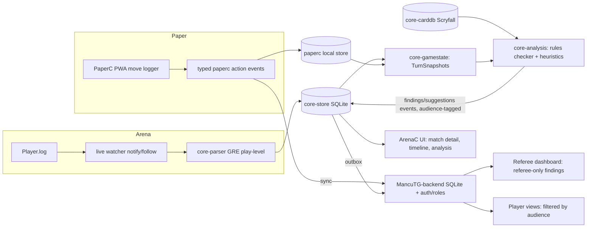
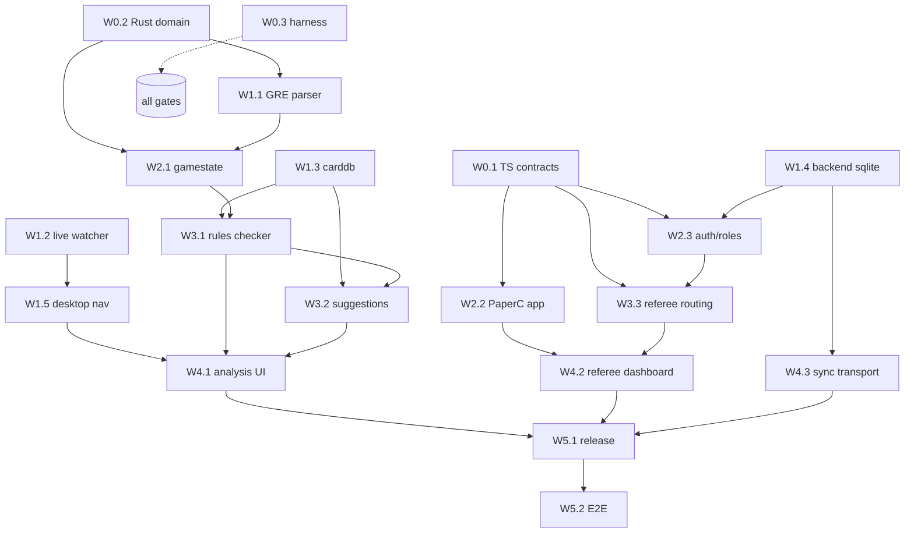

# feat: Finalize MancuTG-Companion into the full Arena + Paper game-analysis product

## Summary

This plan takes the repository from its current state — a robust ingest/storage foundation with an ArenaC MVP shell — to the complete product vision:

1. **Arena play tracking** via read-only log scraping at *play level* (cards, moves, turns), not just match metadata.
2. **Paper play logging** via a manual/assisted move-logging client, so physical games produce the same event stream as Arena games.
3. **Game analysis** on both streams: deterministic rule-break detection and heuristic move suggestions.
4. **Tournament/referee mode**: analysis findings can be routed with restricted visibility so that during live (especially sanctioned) play they are shown **only to the referee**, never to players.

The plan is written for **subagent-driven implementation**: work is decomposed into implementation units with explicit file ownership, dependencies, contracts, and verification commands, grouped into waves that can be executed by parallel subagents with integration gates between waves. Section "Subagent Orchestration Model" is the operating manual for the orchestrator.

This document is written in English (unlike earlier German plans) because its primary consumers are implementation agents.

---

## Problem Frame

The current baseline (verified 2026-07-06 by full-repo review):

**Solid and reusable:**
- Idempotent SQLite event store with raw-chunk storage, checkpoints, rotation/truncation detection, partial-line buffering (`crates/core-store`, `apps/desktop/src-tauri/src/lib.rs`).
- iOS offline log import with dedup and platform tagging.
- Zod contract layer shared across ArenaC / PaperC / backend (`packages/shared-schema`), including a well-designed PaperC event envelope (`observation/review/correction/finalize/reopen`) with provenance, confidence, and review status.
- Startable backend (`/events`, `/sync`, `/media/sessions`, Archidekt read-only) with file-based persistence.
- Full multi-language test chain (`npm test` = typecheck + vitest + cargo + python).

**Missing relative to the product vision:**
- Parser recognizes only 5 coarse event types (match start/end, collection, inventory, draft pick); the entire MTGA gameplay protocol (`GreToClientEvent`) lands in `Unknown` (`crates/core-parser/src/lib.rs:156-191`).
- No live log tailing — `watch_live_log_once` is single-shot and nothing schedules it.
- No card database, no game-state reconstruction, no rules engine, no suggestion engine (zero source hits for rule/legality/analysis/suggestion concepts).
- PaperC is a contract-validation skeleton: no UI, no runtime, no move producer; `card-move` observation payloads are untyped `details: {}`.
- No roles, no auth, no message/visibility model; tournament schema is identity-only (18 lines).
- Desktop UI is a single static dashboard: decorative nav, no match detail/replay, several inert controls, watcher state hardcoded.
- Backend persistence is a JSON file; `core-sync` has no transport.

**Policy note (supersedes one scope line in the 2026-05-06-003 plan):** that plan excluded using detection as a "judge/ruling automation tool in sanctioned matches". This plan keeps the spirit but reframes it: the analysis engine **never issues autonomous rulings**. It produces *findings* (hints with severity, confidence, and rule references) that are routed to a human — by default the player in casual contexts, and **only the referee** in tournament referee-only mode. Human-in-the-loop is a hard invariant, reusing the existing review-queue pattern.

---

## Requirements

- R1. Arena integration stays read-only log parsing, extended to play level: casts, zone transfers, turns/phases, priority, targets, combat, life, mulligans.
- R2. Paper games can be logged move-by-move through a dedicated client UI, producing events in the same shared envelope as Arena events.
- R3. A single game-state reconstruction layer consumes both streams and yields per-turn snapshots/timelines.
- R4. A deterministic rules checker flags *possible* rule-breaks as findings with severity, confidence, and Comprehensive Rules references — never as verdicts.
- R5. A heuristic suggestion engine proposes better lines (clearly labeled as hints).
- R6. Findings carry an `audience` visibility field; in tournament referee-only mode, findings are visible exclusively to users with the referee role.
- R7. Backend gains minimal auth/roles (organizer, referee, player, spectator) scoped per tournament; the desktop app remains fully usable offline without any account.
- R8. Offline-first, log-only, and append-only + projections invariants from the existing architecture are preserved.
- R9. ArenaC desktop app becomes a real multi-view product: match list, per-turn match detail, analysis surfaces, working settings/consent/export controls, continuous live watcher.
- R10. Backend persistence moves to SQLite with cursor-based pull sync; desktop outbox sync gets a real transport.
- R11. Every implementation unit is independently verifiable via existing repo commands (`npm test`, `npm run arenac:smoke`, `npm run api:smoke`) plus unit-specific tests.
- R12. All new work remains Apache-2.0 clean-room (no GPL-derived tracker code).

---

## Scope Boundaries

- No computer-vision/video detection work in this plan. The PaperC video pipeline (plan 2026-05-06-003, Phases A–F) remains a *later* track; this plan delivers paper support via manual logging, which the video pipeline can later feed into the same contracts.
- No ML-based move evaluation (no trained models, no LLM calls at runtime). Suggestions are deterministic heuristics; the finding/suggestion contracts are designed so a stronger engine can be swapped in later.
- No overlay/HUD, no web sharing/profiles, no bidirectional Archidekt.
- No packet capture, memory reading, or game-client hooks (log-only invariant).
- Rules coverage is explicitly *partial*: hidden information and judgment calls make full adjudication impossible; the checker targets high-precision detectable classes (see W3.1) and must prefer false negatives over false positives.

---

## Key Technical Decisions

- **One `GameAction` vocabulary for both products.** `core-domain` gains structured gameplay event types; the Arena parser and the PaperC logger both compile down to them. The reconstruction and analysis layers are source-agnostic.
- **Structured payloads.** Event payloads become `serde_json::Value` (Rust) / typed Zod objects (TS) instead of flat `BTreeMap<String, String>`; the current parser drops nested JSON, which is unacceptable for gameplay data. The `events.payload_json` TEXT column already accommodates this.
- **Card knowledge via Scryfall bulk data, offline.** A `core-carddb` crate imports Scryfall bulk JSON (oracle cards incl. `arena_id`) into a local SQLite table. Download is manual/CLI (consent-gated); analysis works fully offline once imported.
- **Analysis is a pure function over reconstructed state.** `core-gamestate` folds events into `TurnSnapshot`s; `core-analysis` maps `(timeline, carddb) -> findings + suggestions`. No I/O inside the engines — this keeps them unit-testable by fixture and lets subagents work without a running app.
- **Findings are events too.** Analysis findings and suggestions are appended to the same event stream (`analysis.finding.raised`, `analysis.suggestion.raised`) with an `audience` field, so sync, review, and projections reuse existing machinery.
- **Referee-only is enforced server-side and client-side.** The backend filters reads by role; clients additionally suppress referee-only findings outside the referee view. Local single-player (non-tournament) use never requires auth.
- **PaperC MVP is a browser-based PWA** (Vite + React, same stack as desktop) with local persistence and optional backend sync — realistic for a phone/tablet at a tournament table, no new toolchain.
- **Backend moves to `node:sqlite`** (Node 22 built-in) — relational persistence without new infrastructure; JSON store kept behind the same repository interface during migration.
- **Live watching via `notify` + background thread** in the Tauri app and a `--follow` CLI mode, both reusing the proven `watch_live_log_once` incremental core.

---

## Target Architecture

---

## Subagent Orchestration Model

This section is the operating manual for the orchestrating agent. Follow it exactly.

### Execution shape

- Work proceeds in **waves W0–W5**. Units within a wave are independent (disjoint file ownership) and MUST be run as parallel subagents, one unit per subagent, each in an isolated git worktree.
- A wave is complete only when every unit's verification passes AND the **integration gate** (below) passes on the merged result. Do not start wave N+1 units before the gate of wave N, except where a unit's Dependencies line names only specific earlier units that are already merged.
- Each unit below is written to be handed to a subagent verbatim, together with: this plan's "Key Technical Decisions", the unit spec, and the repo's `CLAUDE.md`.

### Contract-freeze discipline

- Wave 0 lands all cross-boundary contracts (`packages/shared-schema/src/*`, `crates/core-domain/src/lib.rs`). After the W0 gate, these files are **frozen**: no later unit may edit them directly.
- If a later unit discovers a contract gap, it must stop, report the needed change, and the orchestrator runs a dedicated micro-unit ("contract amendment") that edits the contract + all compile sites, then resumes the blocked unit. This prevents parallel agents from racing on shared files.

### Per-unit protocol (every subagent)

1. Read the unit spec, `CLAUDE.md`, and the named "Patterns to follow" files before writing code.
2. Implement only within the unit's **Files** list (create/modify). Touching files owned by another unit in the same wave is a defect.
3. Write the unit's tests (listed under Test scenarios) — tests are part of the unit, not optional.
4. Run the unit's **Verification** commands; all must pass. Then run `npm test` (full chain) to prove no regression.
5. Return: summary of what was built, deviations from spec (if any), and any contract-amendment requests.

### Integration gate (end of each wave)

A single integration subagent merges all wave branches, resolves trivial conflicts, and runs: `npm test`, `npm run arenac:build`, `npm run arenac:smoke`, `npm run api:smoke`. Then a **code-review subagent** reviews the wave diff adversarially (correctness, invariant violations: offline-first, log-only, append-only, audience enforcement) and findings are fixed before the wave is declared done.

### Fixture strategy (critical for W1.1)

Real MTGA `Player.log` excerpts with detailed logs enabled are the ground truth for the GRE parser. The repo owner should drop sanitized real log samples into `crates/core-parser/tests/fixtures/gre/` (see W0.3). Until real samples exist, W1.1 builds against synthetic fixtures matching the documented GRE message shapes and marks them clearly; parser acceptance against real logs is re-verified in W5.2. **Orchestrator: surface this to the repo owner at W0 kickoff — it is the plan's main external dependency.**

---

## Implementation Units

### Wave 0 — Contracts and foundations (3 parallel units)

---

- **W0.1 Shared TS contracts v2 (analysis, roles, typed paper actions)**

**Goal:** Extend `packages/shared-schema` with every cross-boundary shape the later waves need, so TS-side contracts are frozen early.

**Requirements:** R2, R4, R5, R6, R7

**Dependencies:** None

**Files:**
- Create: `packages/shared-schema/src/analysis.ts` — `analysisFindingSchema` (`findingId`, `gameKey`, `turnNumber`, `phase`, `kind: 'rule-check' | 'suggestion'`, `code` (stable machine id, e.g. `missed-trigger`, `illegal-target`, `lethal-available`), `severity: 'info' | 'warning' | 'possible-violation'`, `confidence: 0..1`, `ruleRefs: string[]` (CR citations), `description`, `audience: 'players' | 'referee-only' | 'all'`, `engineVersion`); event types `analysis.finding.raised`, `analysis.suggestion.raised`, `analysis.finding.reviewed`.
- Create: `packages/shared-schema/src/roles.ts` — `tournamentRoleSchema` (`organizer | referee | player | spectator`), `tournamentMembershipSchema` (`tournamentId`, `userId`, `role`), `tournamentSettingsSchema` incl. `findingVisibilityMode: 'players' | 'referee-only'`.
- Create: `packages/shared-schema/src/gameActions.ts` — typed action payloads shared by Arena and Paper streams: `playLand`, `castSpell`, `activateAbility`, `triggerNoted`, `declareAttackers`, `declareBlockers`, `damageDealt`, `lifeChanged`, `zoneTransfer`, `mulliganDecision`, `turnBegan`, `phaseChanged`, `priorityPassed`, `gameStarted`, `gameEnded`, `manualNote`, `undoApplied`. Each with `actor`, optional `cardRef` (`{ name?, arenaId?, scryfallOracleId? }`), zone from/to, targets.
- Modify: `packages/shared-schema/src/paperc.ts` — replace untyped `details: z.record(...)` on observation payloads with a discriminated union over `gameActions` payloads (keep a `raw` escape hatch); no removal of existing event types.
- Modify: `packages/shared-schema/src/tournaments.ts` — reference roles/settings schemas.
- Modify: `packages/shared-schema/src/index.ts` — export new modules.
- Test: `packages/shared-schema` gets vitest specs `analysis-contract.spec.ts`, `game-actions-contract.spec.ts` under `apps/desktop/tests/` is wrong location — put them in `services/api/tests/` style: create `packages/shared-schema/tests/` and wire it into the root vitest config if not already picked up (verify `vitest run` globs; if `packages/**` isn't included, extend the root config minimally).

**Approach:** Follow the existing schema idioms in `paperc.ts` (literal unions, `superRefine` cross-field validation, exported TS types). `audience` defaults to `'players'`. Add `validateAnalysisEventContract` mirroring `validatePapercEventContract` (only backend or the local analysis engine may emit `analysis.*`).

**Test scenarios:** valid finding parses; unknown `code` still parses (codes are open enum via `z.string()` + documented registry); `audience` defaults applied; paperc observation with typed `castSpell` payload round-trips; legacy observation with `raw` payload still validates (backward compat).

**Verification:** `npm run typecheck && npm run test:ts`

---

- **W0.2 Rust domain vocabulary v2 (gameplay events, structured payloads)**

**Goal:** Extend `crates/core-domain` so parser, store, gamestate, and analysis speak one typed gameplay language.

**Requirements:** R1, R3, R8

**Dependencies:** None (mirrors W0.1 shapes; orchestrator gives both units the same `gameActions` field tables to keep them aligned)

**Files:**
- Modify: `crates/core-domain/src/lib.rs` — add `EventType` variants: `GameStart`, `GameEnd`, `TurnBegin`, `PhaseChange`, `PriorityPass`, `CardCast`, `LandPlayed`, `AbilityActivated`, `TriggerFired`, `ZoneTransfer`, `AttackersDeclared`, `BlockersDeclared`, `DamageDealt`, `LifeChanged`, `MulliganDecision`, plus existing five + `Unknown`. Extend `from_label`/label round-trip. Add `GameAction` structs matching W0.1 field-for-field (serde, `serde_json::Value` payload carrier on `NormalizedEvent`).
- Modify: `crates/core-store/src/lib.rs` — only what compilation requires: payload serialization goes through `serde_json::Value` instead of `BTreeMap<String,String>` (keep a compatibility deserializer: old rows with flat string maps must still load — write a small migration-on-read).
- Test: extend `crates/core-store/tests/event_store_roundtrip.rs` — roundtrip a `CardCast` event with nested payload; load a legacy flat-map row.

**Approach:** Additive; never rename existing variants or labels (stored data depends on them). Keep `Unknown(String)` as catch-all. Document the label strings in one table in the module docs — parser (W1.1) and paperc mapping (W2.2) both cite it.

**Test scenarios:** label round-trip for every new variant; nested payload survives store roundtrip; legacy flat payload row loads without error; `cargo test --workspace` green.

**Verification:** `npm run test:rust`

---

- **W0.3 Verification harness and fixture scaffolding**

**Goal:** Make the repo safe for many parallel agents: deterministic test entry points, fixture corpus layout, CI parity.

**Requirements:** R11

**Dependencies:** None

**Files:**
- Create: `crates/core-parser/tests/fixtures/gre/README.md` — how to export sanitized MTGA detailed logs (enable detailed logs in Arena, locate `Player.log`, strip account ids), naming convention (`<scenario>__<expectation>.log`), and the synthetic-vs-real marker convention (`synthetic__*` prefix).
- Create: `scripts/verify_all.sh` — one command: `npm test && npm run arenac:build && npm run arenac:smoke && npm run api:smoke` (used by every integration gate).
- Modify: `.github/workflows/*` — ensure the workflow runs `scripts/verify_all.sh` (inspect existing workflow first; extend, don't replace).
- Modify: `package.json` — add `"verify:all": "bash scripts/verify_all.sh"`.

**Approach:** Read the existing workflow before editing; keep runtime under control (cargo build cache). No behavioral code changes.

**Test scenarios:** `npm run verify:all` passes locally from a clean checkout; CI workflow references the script.

**Verification:** `npm run verify:all`

---

### Wave 1 — Data acquisition and product plumbing (5 parallel units)

---

- **W1.1 Arena GRE play-level parser**

**Goal:** Parse MTGA detailed-log gameplay messages (`GreToClientEvent` and companions) into the W0.2 gameplay events — the single most important unit in the plan.

**Requirements:** R1, R8

**Dependencies:** W0.2

**Files:**
- Modify: `crates/core-parser/src/lib.rs` (may split into modules: `src/gre.rs`, `src/mtga_json.rs` — parser crate is wholly owned by this unit).
- Create: fixtures under `crates/core-parser/tests/fixtures/gre/` (synthetic until real samples land; see orchestration note).
- Create: `crates/core-parser/tests/gre_play_level.rs`.

**Approach:**
- Handle the real `Player.log` framing: interleaved plain lines and JSON blobs (single-line and multi-line pretty-printed), `[UnityCrossThreadLogger]` prefixes, request/response wrappers.
- From `GreToClientEvent.greToClientMessages[]` extract at minimum: `GREMessageType_GameStateMessage` (game objects, zones, turn info, players/life), annotations (`AnnotationType_ZoneTransfer`, `ObjectIdChanged`, damage, phase/step), `MulliganReq/Resp`, `DieRollResults`, match result. Map to `EventType` variants; keep `grpId`/`instanceId` in payloads (card names resolve later via carddb).
- Diff-based extraction: game-state messages are diffs; the parser emits *observed transitions* (zone transfer annotations are authoritative for moves) — do not attempt full state tracking here; that is W2.1's job.
- Everything unrecognized keeps flowing to `Unknown` + `ingest_diagnostics` (existing pattern) — never panic on malformed input (`parse_log_lossy` contract).
- Preserve all existing five event mappings and their tests.

**Test scenarios:** golden test per fixture scenario (a cast, a combat, a full short game); malformed/truncated JSON degrades to Unknown + diagnostic; existing `golden_logs.rs` unchanged and green; throughput sanity: parse a 50MB synthetic log < 10s in release (`#[ignore]`d perf test).

**Verification:** `cargo test -p mancutg-core-parser` (adjust to actual crate name from `Cargo.toml`) and `npm run test:rust`

---

- **W1.2 Continuous live watcher**

**Goal:** Real tailing of `Player.log`: background follow loop in the Tauri app + `watch-log --follow` CLI, built on the existing one-shot incremental core.

**Requirements:** R1, R9

**Dependencies:** None (uses existing `watch_live_log_once`)

**Files:**
- Modify: `apps/desktop/src-tauri/src/lib.rs` — add `watch_live_log_follow` (loop: `notify` event or 2s poll fallback → `watch_live_log_once_with_store`), start/stop handles, watcher status struct.
- Modify: `apps/desktop/src-tauri/src/commands.rs`, `src/main.rs` — Tauri commands `start_watcher`, `stop_watcher`, `watcher_status`; emit a Tauri event (`store-updated`) after each ingest so the UI can refresh.
- Modify: `apps/desktop/src-tauri/src/cli_main.rs` — `watch-log --follow` flag.
- Modify: `apps/desktop/src-tauri/Cargo.toml` — add `notify` (and only that; keep gui feature gating intact).
- Modify: `apps/desktop/src/lib/tauri/commands.ts` — typed wrappers for the three commands.
- Test: extend `apps/desktop/src-tauri/tests/live_watcher.rs` — follow loop picks up appends within a bounded window; stop terminates cleanly; rotation mid-follow handled.
- Also: default Arena log path detection per OS (`default_arena_log_path()` for Windows/macOS) surfaced through `watcher_status`, so Setup can show a real `logPath` (fixes the always-"Pending" setup state).

**Approach:** Thread + channel; no tokio (keep dependency surface minimal, matching current crate style). The follow loop is library code testable without Tauri (follow the existing `_with_store` pattern).

**Test scenarios:** append while following → events appear, no duplicates after restart (checkpoint reuse); stop is idempotent; missing file → keeps waiting, no crash.

**Verification:** `npm run test:rust && npm run arenac:smoke`

---

- **W1.3 Card database (`core-carddb`)**

**Goal:** Offline card knowledge: import Scryfall bulk data into SQLite; lookup by `arena_id` and by name.

**Requirements:** R4, R5, R8, R12

**Dependencies:** None

**Files:**
- Create: `crates/core-carddb/` (new workspace member: `Cargo.toml`, `src/lib.rs`, `migrations/001_cards.sql`, `tests/import_and_lookup.rs`, small fixture JSON).
- Modify: root `Cargo.toml` workspace members.
- Modify: `apps/desktop/src-tauri/src/cli_main.rs` + `src/lib.rs` — CLI `import-card-db <path-to-scryfall-bulk.json>` and `card-db-status`; store DB beside the event store (`default_store_path` sibling `cards.sqlite`).
- Test: import fixture of ~20 cards; lookups.

**Approach:** Streaming JSON parse (bulk file is ~2GB, must not load into memory — use `serde_json::Deserializer::from_reader` into an iterator). Table `cards(scryfall_oracle_id, arena_id, name, mana_cost, cmc, type_line, oracle_text, colors, keywords, legalities_json, set_code)`; indexes on `arena_id` and `name`. Import is idempotent (INSERT OR REPLACE). Download stays manual (document the Scryfall bulk-data URL in the CLI help); no runtime network calls (offline-first, consent posture unchanged).

**Test scenarios:** fixture import → row count; lookup by arena_id and by exact + case-insensitive name; re-import idempotent; missing fields tolerated.

**Verification:** `npm run test:rust`

---

- **W1.4 Backend SQLite persistence + cursor pull sync**

**Goal:** Replace the JSON-file store with `node:sqlite` behind the existing service interfaces; add cursor-based pull so clients can fetch tournament-scoped events.

**Requirements:** R7, R10

**Dependencies:** None (contracts frozen in W0.1)

**Files:**
- Create: `services/api/src/store/sqliteStore.ts` (tables: `sessions`, `events` (with per-insert monotonic `cursor` INTEGER PRIMARY KEY), `media_sessions`, `media_artifacts`, dedupe keys as UNIQUE constraints mirroring current in-memory logic in `eventService.ts:154-229`).
- Modify: `services/api/src/domain/eventService.ts`, `domain/paperc/mediaSessionService.ts` — depend on a `Store` interface; JSON store remains as fallback when `MANCUTG_BACKEND_STORE_PATH` ends in `.json` (compat), SQLite otherwise.
- Create: `services/api/src/routes/eventsPull.ts` — `GET /events?cursor=<n>&limit=<m>[&tournamentId=...]` returning `{ events, nextCursor }`.
- Modify: `services/api/src/server.ts` — route registration.
- Test: `services/api/tests/sqlite-store.spec.ts`, `events-pull.spec.ts`; existing contract specs must pass unchanged against SQLite.

**Approach:** `node:sqlite` (Node 22 built-in, matches `--experimental-strip-types` runtime; verify flag needs). Keep append-only: no UPDATE on events. Read `docs/plans/2026-05-07-002` "JSON-Store bleibt Zwischenstation" — this unit is that promised transition.

**Test scenarios:** all existing `services/api/tests/*` green on SQLite; dedupe/idempotency semantics identical (same keys); pull pagination: stable ordering, no gaps/duplicates across pages; restart persistence.

**Verification:** `npm run test:ts && npm run api:smoke`

---

- **W1.5 Desktop navigation, detail views, and control wiring**

**Goal:** Turn the static dashboard into a navigable app and fix every inert control found in review.

**Requirements:** R9

**Dependencies:** None (pure TS/React; new Tauri commands from W1.2 are stubbed behind the existing `commands.ts` types if W1.2 lands later — orchestrator should merge W1.2 first when possible)

**Files:**
- Modify: `apps/desktop/src/app/ArenaAppShell.tsx`, `renderArenaAppShell.tsx`, `main.tsx` — view-switching state (no router lib needed): sidebar entries become buttons selecting one active view; keep the summary strip global.
- Create: `apps/desktop/src/routes/history/MatchList.tsx` + `MatchDetail.tsx` — render the full `records[]` (already loaded, currently collapsed to a count) and a per-match event timeline via a new `inspect_match` Tauri command (this unit adds the command reading events by `match_id` from the store — coordinate: Rust command lives in `src-tauri/src/lib.rs` `build_*` read-model section, follow `load_match_history` pattern).
- Modify: draft view (render actual picks list), diagnostics view (render diagnostics array), decks view (hide the dead Archidekt button behind a "coming soon" disabled state — Archidekt UI wiring is not in this plan's critical path).
- Modify: settings/privacy views — wire `tauriSetConsent` toggles (command exists, never called: `commands.ts:105`), wire export to actually save (`export_backup` result → file via Tauri save dialog or `fs` plugin write; result currently discarded at `main.tsx:139-141`), wire watcher start/stop + status polling to W1.2 commands.
- Test: extend `apps/desktop/tests/*.spec.ts(x)` for view switching, match detail state builder, consent wiring (mock invoke), export invocation.

**Approach:** Keep the pure state-builder pattern (`routes/*/index.ts` stay pure; components consume them) — the repo's tests depend on it. Match the existing German/English text mix.

**Test scenarios:** clicking nav switches view; match detail shows per-event rows for a fixture store; consent toggle calls `set_consent` with correct args; export writes a file (mocked dialog).

**Verification:** `npm run typecheck && npm run test:ts`

---

### Wave 2 — Game understanding and identity (3 parallel units)

---

- **W2.1 Game-state reconstruction (`core-gamestate`)**

**Goal:** Fold gameplay events (from either source) into deterministic per-turn snapshots and a game timeline — the substrate for all analysis.

**Requirements:** R3, R8

**Dependencies:** W0.2, W1.1

**Files:**
- Create: `crates/core-gamestate/` (workspace member): `src/lib.rs` — `GameTimeline::from_events(&[NormalizedEvent]) -> GameTimeline`; types `TurnSnapshot { turn_number, active_player, phase_states, zones: per-player {battlefield, graveyard, exile, hand_count, library_count}, life_totals, actions: Vec<GameAction> }`, `ObjectState { instance_id, grp_id/card_ref, controller, tapped, counters (best-effort) }`.
- Create: `crates/core-gamestate/tests/reconstruction.rs` + fixtures (event JSON, generated from W1.1 fixture outputs — this unit may commit serialized parser outputs as its fixtures).
- Modify: `apps/desktop/src-tauri/src/lib.rs` — read model `load_game_timeline(match_id)` exposing the timeline to UI/analysis; Tauri command + `commands.ts` wrapper.

**Approach:** Pure, no I/O. Hidden information is modeled honestly: opponent hand/library are counts only; unknown cards are `CardRef::Unknown(instance_id)`. Paper events (typed `GameAction`s) enter the same fold — where Arena gives instance ids and Paper gives names, `CardRef` unifies. Tolerate gaps: a timeline built from partial logs flags `completeness: Partial(reason)` rather than failing.

**Test scenarios:** replaying a fixture game yields expected battlefield/life per turn; zone-transfer ordering conflicts resolved deterministically; partial log → Partial completeness, no panic; paper-sourced action list reconstructs equivalently.

**Verification:** `npm run test:rust`

---

- **W2.2 PaperC move-logging app (MVP)**

**Goal:** A runnable browser PWA for logging a physical game move-by-move, producing shared-contract events — the paper counterpart to the Arena log.

**Requirements:** R2, R8

**Dependencies:** W0.1

**Files:**
- Create: `apps/paperc/` app runtime around the existing builders: `index.html`, `vite.config.ts`, `package.json` wiring into the workspace, `src/app/` (React shell), `src/state/gameLog.ts` (append-only local action log + undo-as-correction), `src/state/persistence.ts` (localStorage/IndexedDB), `src/sync/outbox.ts` (POST batches to `/events` using existing envelope; offline queue).
- UI surfaces: game setup (players, format, optional `tournamentContext`), turn/phase stepper, action palette (play land / cast spell / attack / block / life change / trigger noted / note), card name entry with fuzzy autocomplete against a bundled card-name index (`scripts/build_card_name_index.ts` generating a compressed name list from a Scryfall bulk file — build-time, not runtime, keeping the client offline-capable), event review list with undo (emits `undoApplied` correction, never deletes).
- Keep: existing `src/capture|events|tournaments` builders as the emission layer (they are the contract guards).
- Test: `apps/paperc/tests/` — game-log reducer specs (action → typed event via builders), undo semantics, outbox retry/dedup (`idempotencyKey`), existing `paperc-event-emission.spec.ts` stays green.
- Modify: root `package.json` — `paperc:dev`, `paperc:build` scripts; include paperc tests in `test:ts`.

**Approach:** Reuse desktop UI idioms (`ShellPanel`-like layout; copy patterns, not files — component ownership stays separate). Every logged action becomes a `paperc.observation.detected` event with a typed `gameActions` payload, `provenance: 'manual'`, `confidence: 1`. Append-only + corrections mirrors the store invariant.

**Test scenarios:** logging a scripted 3-turn game produces the expected event batch (golden JSON); undo emits correction, projection of the log hides undone action; offline logging then sync flush posts once (idempotent on retry).

**Verification:** `npm run typecheck && npm run test:ts && npm run paperc:build`

---

- **W2.3 Backend auth, roles, and tournament membership**

**Goal:** Minimal token auth + per-tournament roles so referee-only visibility (W3.3) has something to enforce against.

**Requirements:** R6, R7

**Dependencies:** W0.1, W1.4

**Files:**
- Create: `services/api/src/auth/tokens.ts` (opaque bearer tokens, hashed at rest in SQLite `users`/`tokens` tables; CLI-less bootstrap: `POST /auth/register` gated by `MANCUTG_ALLOW_REGISTRATION`), `services/api/src/auth/roles.ts` (membership store + `requireRole(tournamentId, ...roles)` middleware).
- Create: `services/api/src/routes/tournaments/index.ts` — create tournament (creator becomes organizer), add member with role, get my role.
- Modify: `services/api/src/server.ts`, `auth/optionalMode.ts` — anonymous mode stays default for existing routes (backward compat, offline-first: desktop sync without account keeps working); auth is required only for tournament-scoped routes.
- Test: `services/api/tests/auth-roles.spec.ts` — role assignment, `requireRole` rejections, anonymous paths unaffected (existing `auth-optional-mode.spec.ts` green).

**Approach:** Deliberately boring: bearer token in `Authorization`, no OAuth/sessions/password reset in this plan. Follow existing route/service separation style.

**Test scenarios:** organizer can add referee; player cannot add members; unauthenticated tournament route → 401; legacy `/events` without auth still 200.

**Verification:** `npm run test:ts && npm run api:smoke`

---

### Wave 3 — Analysis and tournament enforcement (3 parallel units)

---

- **W3.1 Rules checker (`core-analysis`, part 1)**

**Goal:** Deterministic detection of *possible* rule-breaks over a `GameTimeline` + card DB, emitted as audience-tagged findings.

**Requirements:** R4, R6, R8

**Dependencies:** W2.1, W1.3

**Files:**
- Create: `crates/core-analysis/` (workspace member): `src/lib.rs` (`analyze(timeline, carddb) -> Vec<Finding>`; `Finding` mirrors W0.1 `analysisFindingSchema` field-for-field), `src/checks/` one module per check, `tests/checks/` fixture-driven specs per check.
- Modify: `apps/desktop/src-tauri/src/lib.rs` — `analyze_match(match_id)` read model + Tauri command persisting findings as `analysis.finding.raised` events (append-only); `commands.ts` wrapper.

**Approach — initial check catalog (high precision, prefer false negatives):**
1. `extra-land-drop` — >1 land by a player in a turn without a known enabler (CR 305.2).
2. `timing-violation` — sorcery-speed cast at instant timing without flash (needs carddb type/oracle check) (CR 307.1 / 117.1a).
3. `sba-lethal-damage` — creature with damage ≥ toughness persisting across a state check window (paper logs mainly) (CR 704.5g).
4. `mana-impossible` — cast with total cost exceeding plausibly available mana from untapped sources (conservative: only flag when strictly impossible) (CR 601.2).
5. `illegal-attack` — attacking with a creature logged as entering this turn without haste (CR 302.6).
6. `missed-trigger-hint` — known mandatory ETB/upkeep trigger (from oracle text keyword scan of a curated trigger list) with no corresponding logged effect — `info` severity, low confidence.
Every check yields `ruleRefs`, `confidence`, and severity ≤ `possible-violation`; a doc comment per check states its known blind spots. Checks that need unavailable info must not fire.

**Test scenarios:** per check: one positive fixture, one near-miss negative fixture (the legal case that superficially resembles the violation); Arena-sourced and paper-sourced timelines both analyzable; engine is deterministic (same input → identical findings incl. ordering).

**Verification:** `npm run test:rust`

---

- **W3.2 Suggestion engine (`core-analysis`, part 2)**

**Goal:** Heuristic "better move" hints over the same timeline.

**Requirements:** R5

**Dependencies:** W2.1, W1.3 (parallel-safe with W3.1: orchestrator note — W3.1 owns `crates/core-analysis` creation; run W3.2 immediately after W3.1 merges, or have W3.2 branch from W3.1's branch. Do NOT run truly concurrently on the same crate.)

**Files:**
- Create: `crates/core-analysis/src/suggest/` — `lethal-available` (attack math shows lethal not taken), `unused-mana-with-play` (end of own turn with untapped mana + castable card known in hand — Arena only, hand known for the local player), `missed-land-drop` (playable land in known hand, none played), `no-block-lethal-taken` (player died to attack with legal blocks available).
- Create: `tests/suggest/` fixture specs.

**Approach:** Suggestions are `kind: 'suggestion'`, severity `info`, `audience` inherits mode default. Simple combat math only (power/toughness, no ability evaluation beyond flying/reach/deathtouch from carddb keywords). Honest about hidden info: never suggest based on cards the engine shouldn't know.

**Test scenarios:** lethal fixture flags; non-lethal near-miss doesn't; hidden-info discipline (opponent-hand-dependent suggestion never fires for opponent).

**Verification:** `npm run test:rust`

---

- **W3.3 Referee-only routing and tournament findings API**

**Goal:** Enforce `audience` end-to-end on the backend: referee-only findings reach referees and nobody else.

**Requirements:** R6, R7

**Dependencies:** W2.3, W1.4, W0.1

**Files:**
- Create: `services/api/src/domain/findingsService.ts` — ingest `analysis.*` events (they arrive via existing `/events`), project into a findings read model keyed by tournament/match; visibility resolution: tournament `findingVisibilityMode` + finding `audience` + requester role.
- Create: `services/api/src/routes/tournaments/findings.ts` — `GET /tournaments/:id/findings` (referee/organizer: all; player: only `players`/`all`-audience findings, and none at all while mode is `referee-only`), `POST /tournaments/:id/findings/:findingId/review` (referee resolves/dismisses → `analysis.finding.reviewed` event; reuses paperc review idiom).
- Modify: `services/api/src/server.ts` route registration; `packages/shared-schema` is frozen — if a gap is found, contract-amendment protocol.
- Test: `services/api/tests/findings-visibility.spec.ts` — the security-critical matrix.

**Approach:** Server-side filtering is the enforcement point (client filtering is cosmetic). Visibility matrix is table-driven in one function with exhaustive unit tests: {mode × audience × role} → visible?. Default deny.

**Test scenarios:** referee sees referee-only finding; player gets 200 with it absent (not 403 — presence must not leak); spectator sees nothing in referee-only mode; organizer counts as referee for visibility; review transition emits event and is idempotent.

**Verification:** `npm run test:ts && npm run api:smoke`

---

### Wave 4 — Product surfaces and sync (3 parallel units)

---

- **W4.1 ArenaC analysis UI**

**Goal:** Surface timeline + findings + suggestions in the desktop match detail; make analysis a first-class local feature.

**Requirements:** R5, R9

**Dependencies:** W1.5, W2.1, W3.1, W3.2

**Files:**
- Modify: `apps/desktop/src/routes/history/MatchDetail.tsx` — turn-by-turn timeline (from `load_game_timeline`), findings markers inline at their turn/phase, suggestions panel, "Run analysis" action calling `analyze_match`; severity/confidence visual treatment; empty states (no card DB imported → guidance to `import-card-db`).
- Modify: `apps/desktop/src/routes/settings/index.ts` + view — analysis enable toggle, card DB status display.
- Modify: `apps/desktop/src/lib/tauri/commands.ts` — wrappers if not already added by W2.1/W3.1.
- Test: state-builder specs for timeline/finding view models; render spec for markers.

**Approach:** Keep pure state-builders; findings text shows `ruleRefs` and confidence verbatim — no overclaiming language ("possible", never "cheated").

**Test scenarios:** fixture timeline with 2 findings renders markers on correct turns; no-carddb state shows guidance; analysis toggle persists via settings.

**Verification:** `npm run typecheck && npm run test:ts`

---

- **W4.2 Referee dashboard and referee-only mode in PaperC**

**Goal:** The tournament-facing surface: referee sees live findings for their tournament; players in referee-only mode see nothing.

**Requirements:** R2, R6

**Dependencies:** W2.2, W2.3, W3.3

**Files:**
- Create: `apps/paperc/src/app/RefereeView.tsx` + `src/state/refereeFeed.ts` — login (token), tournament selector, findings feed polling `GET /tournaments/:id/findings` (cursor-friendly), acknowledge/review actions.
- Modify: PaperC game-setup flow — when a game is bound to a tournament with `findingVisibilityMode: 'referee-only'`, the logging UI shows a persistent "analysis routed to referee" notice and renders no findings locally.
- Test: feed reducer specs; visibility-suppression spec (player client with referee-only tournament shows zero findings even if events contain them).

**Approach:** Poll (5–10s) rather than websockets — matches backend simplicity; the feed component is transport-agnostic for a later push upgrade.

**Test scenarios:** referee feed renders findings with severity ordering; review action posts and updates state; player-mode suppression holds even with findings present in local data.

**Verification:** `npm run typecheck && npm run test:ts && npm run paperc:build`

---

- **W4.3 Desktop sync transport (outbox → backend)**

**Goal:** Give `core-sync` a real transport so local events (including analysis findings for tournament matches) reach the backend when sync consent is on.

**Requirements:** R8, R10

**Dependencies:** W1.4 (pull endpoint), existing consent gating

**Files:**
- Modify: `crates/core-sync/src/lib.rs` — outbox table (migration in `core-store/migrations/002_outbox.sql`), enqueue on ingest when sync enabled, batch builder producing the shared `/events` envelope.
- Modify: `apps/desktop/src-tauri/src/lib.rs` — `sync_now` command: drain outbox → POST `/events` (use `ureq` or `reqwest` minimal-features; respect `PrivacySettings.syncEnabled` — hard-gate, tested), exponential backoff, `idempotencyKey` per batch.
- Modify: `apps/desktop/src/lib/network/privacy.ts` + settings view — sync trigger + status.
- Test: `crates/core-sync/tests/` outbox drain semantics against a mock server (spawn tiny HTTP listener in test); consent-off → no network attempt (assert zero requests).

**Approach:** Sync remains manual/explicit in this plan (button + on-watcher-idle optional later). Never sync raw chunks unless `rawUploadEnabled`.

**Test scenarios:** enqueue→drain→ack marks synced; server 500 → retry with backoff, no duplicate server rows (idempotency); consent off → outbox accumulates, zero requests.

**Verification:** `npm run test:rust && npm run test:ts`

---

### Wave 5 — Finalization (2 units, sequential)

---

- **W5.1 Packaging, docs, release hardening**

**Goal:** Shippable artifacts and truthful docs.

**Requirements:** R11

**Dependencies:** All prior waves

**Files:**
- Modify: `docs/release/mancutg-arenac-mvp-checklist.md` → superseded by `docs/release/mancutg-companion-1.0-checklist.md` (new file; old one kept): covers arena flow, paper flow, analysis, referee mode, card DB import, sync.
- Modify: `README.md`, `CLAUDE.md`, `docs/privacy/data-flow.md` — new components (carddb, gamestate, analysis, paperc app, auth/roles, findings visibility path — privacy doc MUST document that referee-only findings sync to the backend and who can read them).
- Verify/adjust Tauri bundling config (`tauri.conf.json`) produces a desktop bundle; `paperc:build` static bundle documented for simple hosting.
- Modify: `scripts/verify_all.sh` — include `paperc:build`.

**Test scenarios:** `npm run verify:all` green; release checklist executable top-to-bottom by a human.

**Verification:** `npm run verify:all`

---

- **W5.2 End-to-end scenario verification**

**Goal:** Prove the product vision as executable scenarios; re-validate the GRE parser against real logs.

**Requirements:** R1–R6, R11

**Dependencies:** W5.1

**Files:**
- Create: `scripts/e2e_arena_flow.sh` — synthetic (or real, if provided) detailed log → `bootstrap`/`watch-log` → `inspect-store` shows play-level events → `analyze_match` CLI path emits findings (add a thin `analyze-match` CLI subcommand if only the Tauri command exists).
- Create: `scripts/e2e_paper_referee_flow.sh` — start api with temp SQLite → register organizer+referee+player → create referee-only tournament → post a scripted paper game with a seeded violation via `/events` → assert referee findings feed contains it and player feed does not (curl + jq assertions).
- Create: `apps/desktop/tests/smoke/analysis-e2e.spec.ts` if a TS-level harness is more maintainable for parts of the above.
- Action item (human): validate W1.1 against at least three real sanitized `Player.log` files; file follow-up fixes as micro-units.

**Test scenarios:** both scripts exit 0 from clean checkout; referee/player visibility assertion is the release-blocking test.

**Verification:** `bash scripts/e2e_arena_flow.sh && bash scripts/e2e_paper_referee_flow.sh && npm run verify:all`

---

## Dependency Graph

Parallelism summary: W0 = 3 agents; W1 = 5 agents; W2 = 3 agents; W3 = 2 agents then W3.2 (shared crate with W3.1); W4 = 3 agents; W5 sequential. Worst-case critical path: W0.2 → W1.1 → W2.1 → W3.1 → W4.1 → W5.1 → W5.2.

---

## Cross-cutting Test & Verification Strategy

- Every unit ships its own tests; the full chain (`npm test`) is the regression floor at every merge.
- Fixture-driven purity: parser, gamestate, and analysis are pure functions tested by golden fixtures — subagents need no running app.
- Security-critical surface: the visibility matrix (W3.3) and client suppression (W4.2) get exhaustive table tests plus the E2E assertion in W5.2; a finding leaking to a player in referee-only mode is release-blocking.
- Invariant checks at every code-review gate: offline-first (no new mandatory network), log-only (no client hooks), append-only (no event mutation), human-in-the-loop (no autonomous ruling language), Apache-2.0 cleanliness.

---

## Risks and Open Questions

- **GRE log corpus (top risk):** parser quality is bounded by fixture realism. Mitigation: synthetic fixtures + explicit W5.2 revalidation with real logs; owner action item at W0 kickoff. Arena patches will also drift the format — the Unknown+diagnostics funnel is the early-warning system.
- **Rules coverage expectations:** MTG's full rules are not deterministically checkable from logs. The check catalog is deliberately high-precision/low-recall; product copy must say "possible rule-breaks", and the referee review step is the authority. Expanding the catalog is post-1.0 iterative work.
- **Sanctioned-play compliance:** whether referees may consult such a tool is a tournament-policy question outside the software. The referee-only mode is designed so the tool *can* be used compliantly; docs must state this plainly.
- **`node:sqlite` maturity** under `--experimental-strip-types` Node 22: if it proves unstable, fall back to `better-sqlite3` behind the same `Store` interface (interface designed for this swap).
- **PaperC input speed at a real table:** move logging must be faster than the game. The action palette design should be validated with a real game early (after W2.2) — cheap to iterate while later waves proceed.

---

## Definition of Done (product)

1. Playing an Arena match with detailed logs on, the app live-ingests it, shows a per-turn timeline, and "Run analysis" yields findings/suggestions with rule references — fully offline.
2. A paper game can be logged turn-by-turn on a phone browser in under the pace of play, producing the same event shape.
3. A tournament in referee-only mode routes every finding exclusively to referee-role users, verified by automated tests and the E2E script.
4. `npm run verify:all` and both E2E scripts pass from a clean checkout; release checklist is truthful.
